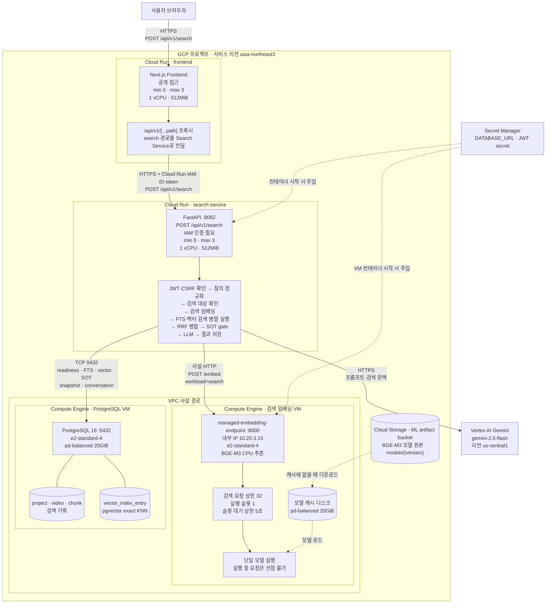

# 검색 경로 Deployment Diagram

- 기준일: 2026-07-30
- 대상 환경: `infra/terraform/envs/gcp-perf`
- 목적: #104 검색 부하테스트 실행 전 현재 배포 구조와 예상 병목 지점을 이해한다.

## 범위와 읽는 법

이 문서는 **현재 코드와 Terraform에 선언된 상태**를 그린다. 실제 GCP에 수동 변경이나 배포 드리프트가 없는지는 첫 측정 전에 별도로 확인한다.

- 실선: 검색 요청 한 건이 지나가는 실행 경로
- 점선: 시작 시 설정·모델을 읽는 경로 또는 배포 제어 경로
- `?`: 코드나 Terraform만으로 실제 배포값을 확정할 수 없는 항목

기존 `Architecture_Diagram_Search.png`는 검색의 논리 구조를 설명한다. 이 문서는 그 그림을 대체하지 않고, **프로그램이 실제로 어디에 몇 대 배포되는지**를 보완한다.

## 현재 배포 구조

## 검색 요청 한 건의 코드 경로

| 순서 | 실행 위치 | 실제 동작 | 다음 호출 |
|---:|---|---|---|
| 1 | Frontend Cloud Run | `/api/v1/search`를 `SEARCH_SERVICE_URL`로 프록시한다. Cloud Run IAM ID 토큰을 `X-Serverless-Authorization`에 넣는다. | Search Service |
| 2 | Search Service | JWT 또는 쿠키 인증·CSRF 확인 후 질의를 정규화한다. 길이는 2~1,000자로 제한한다. | `SearchOrchestrator.execute` |
| 3 | Search Service | 코퍼스 준비 상태와 현재 serving target을 확인한다. | PostgreSQL |
| 4 | Search Service | serving target의 모델 버전마다 검색 질의 하나를 임베딩한다. | 검색 임베딩 VM |
| 5 | 검색 임베딩 VM | 검색 큐 입장 후 단일 실행 슬롯에서 BGE-M3 추론을 수행한다. | Search Service |
| 6 | Search Service | FTS와 벡터 검색을 `asyncio.gather`로 동시에 요청한다. | PostgreSQL |
| 7 | PostgreSQL | `to_tsvector` 기반 FTS와 pgvector `<=>` 기반 exact KNN을 실행한다. | Search Service |
| 8 | Search Service | 두 순위를 RRF로 합친 뒤 SOT gate로 READY·SERVABLE 상태를 다시 검증한다. | PostgreSQL |
| 9 | Search Service | 통과한 청크로 프롬프트를 만들고 답변을 생성한다. | Vertex AI Gemini |
| 10 | Search Service | 검색 스냅샷과 대화 기록을 저장하고 응답한다. | PostgreSQL → Frontend → 브라우저 |

## 배포 상한과 확인 상태

| 구간 | 코드·Terraform에서 확인한 값 | 첫 측정 전 확인할 것 |
|---|---|---|
| Frontend Cloud Run | min 0, max 3, 1 vCPU, 512MiB | 실제 ready revision과 현재 인스턴스 수 |
| Search Service Cloud Run | min 0, max 3, 1 vCPU, 512MiB, 요청 timeout 300초 | 테스트 중 min 1 적용 여부, Cloud Run 요청 동시성 `?` |
| Search → 임베딩 HTTP | timeout 15초, 실패 시 최대 재시도 1회 | 재시도가 실제 부하를 얼마나 늘리는지 |
| 검색 임베딩 VM | e2-standard-4, 실행 슬롯 1, 요청 상한 32, 슬롯 대기 5초 | 현재 컨테이너 환경변수와 CPU 사용률 |
| PostgreSQL 연결 풀 | Search Service 인스턴스당 기본 5 + overflow 10, pool timeout 30초 | `max_connections`, 실제 연결 수, 연결 획득 대기 |
| PostgreSQL VM | e2-standard-4, PostgreSQL 16, pd-balanced 20GiB | 실제 인덱스 목록, 디스크·버퍼 상태 |
| LLM | `gemini-2.5-flash`, timeout 60초, us-central1 | #104 주 시나리오에서는 mock으로 제외 |

## 이 그림에서 바로 보이는 병목 가설

| 우선순위 | 예상 지점 | 근거 | 실측으로 확인할 값 |
|---:|---|---|---|
| 1 | 검색 임베딩 VM 입장 제어 | 실행 슬롯이 1이고 대기 상한이 5초다. 실행 중 추론은 선점할 수 없다. | 동시 검색 증가에 따른 queue wait, 503, 추론 시간 |
| 2 | PostgreSQL FTS | `COALESCE(enriched_text, text)`에 매번 `to_tsvector`를 적용한다. 현재 계획상 FTS GIN 인덱스가 없다. | FTS p95, `EXPLAIN (ANALYZE, BUFFERS)` |
| 3 | PostgreSQL exact KNN | `<=>` 정렬 기반 exact 검색이라 코퍼스 증가에 따라 비교 대상이 늘어난다. | 청크 1천·1만·5만에서 vector p95와 실행 계획 |
| 4 | DB 연결 풀 | Cloud Run이 최대 3대로 늘면 애플리케이션 풀 상한도 최대 45개가 된다. 풀 대기는 30초라 임베딩보다 늦게 실패할 수 있다. | connection acquire 시간, `pg_stat_activity`, timeout |
| 5 | 리전 간 LLM 호출 | Search Service는 `asia-northeast3`, Gemini 설정은 `us-central1`이다. | 실제 E2E 검증에서 LLM 시간. 부하 판정에서는 제외 |
| 6 | Frontend·Search Service cold start | 둘 다 Terraform 기본 min 0이다. | 첫 요청과 warm 요청의 차이. 본 측정은 min 1로 분리 |

## 아직 단정하지 않는 것

- Cloud Run 요청 동시성은 Terraform에 명시되지 않았다. 공급자 기본값을 추측하지 않고 실제 배포 설정을 조회한다.
- Terraform의 `max 3`은 실제로 항상 3대가 실행된다는 뜻이 아니다. 부하에 따라 0~3대 사이에서 변한다.
- `ann_search`라는 함수명과 달리 현재 SQL은 ANN 인덱스가 확인되지 않은 exact KNN이다.
- 기존 논리 그림의 `Metadata DB`와 `Vector Store`는 물리적으로 분리된 서버가 아니라 같은 PostgreSQL VM 안의 서로 다른 테이블이다.
- 이 그림은 구조와 자원 경계를 보여준다. 단계별 처리 시간과 대기 시간은 별도의 Value Stream Map에서 작성한다.

## 코드와 설정 근거

- Frontend 검색 프록시: `frontend/src/app/api/v1/[...path]/route.ts:14`, `:33`, `:58`
- 검색 API 진입점: `services/search-service/src/api/v1/routers/search.py:49`
- 검색 전체 흐름: `services/search-service/src/services/search_orchestrator.py:128`
- FTS·벡터 검색 병렬 실행: `services/search-service/src/services/search_orchestrator.py:241`
- 검색 임베딩 HTTP 호출: `services/search-service/src/infra/embedding/client.py:35`
- PostgreSQL FTS: `services/search-service/src/infra/db/search_repository.py:265`
- PostgreSQL 벡터 검색: `services/search-service/src/infra/db/search_repository.py:322`
- SOT gate: `services/search-service/src/infra/db/search_repository.py:382`
- GCP 배치와 라우팅: `infra/terraform/envs/gcp-perf/main.tf:22`, `:277`, `:305`, `:398`, `:452`
- 인스턴스·대기 기본값: `infra/terraform/envs/gcp-perf/variables.tf:108`, `:118`, `:132`, `:160`, `:254`
- Cloud Run 기본 인스턴스·자원·timeout: `infra/terraform/modules/cloud_run_service/variables.tf:44`, `:54`, `:64`, `:69`, `:74`
- 임베딩 VM 실행 슬롯 기본값: `infra/terraform/modules/embedding_vm/variables.tf:72`
- PostgreSQL 연결 풀 생성: `services/search-service/src/infra/db/session.py:4`
