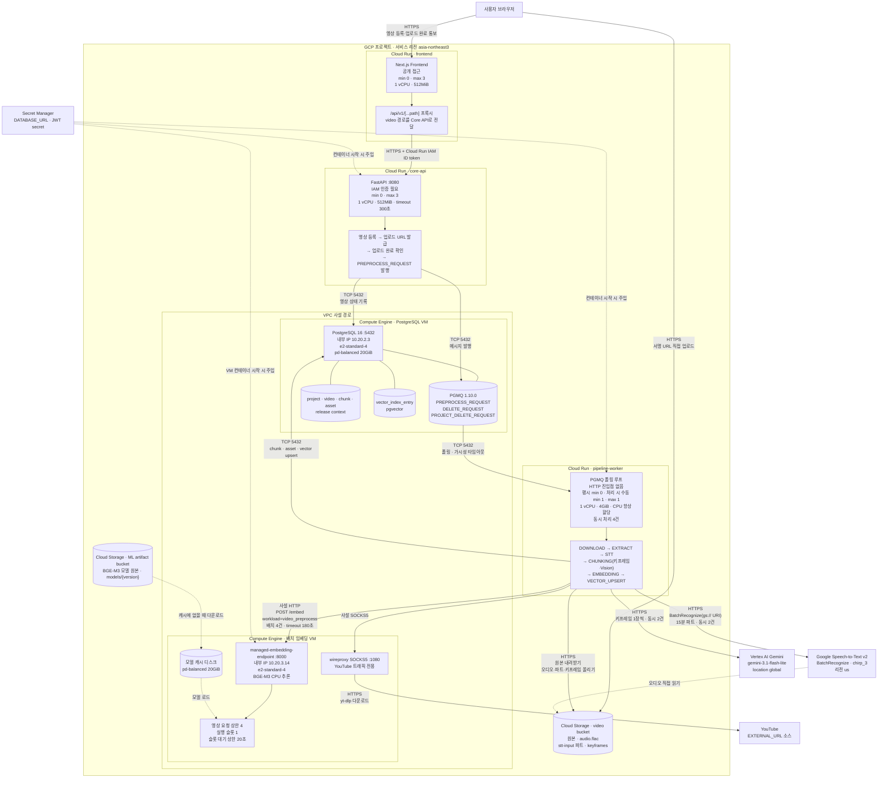

# 영상 처리 경로 Deployment Diagram

- 기준일: 2026-08-02
- 대상 환경: `infra/terraform/envs/gcp-perf`

## 목적과 범위

이 문서는 영상 처리에 참여하는 **배포 단위, 실행 위치, 저장소, 서비스 간 연결**을 보여준다. 인스턴스 수와 자원처럼 운영 시 확인해야 하는 배포값도 함께 기록한다.

처리 단계별 순서·시간·대기·재시도 정책은 다루지 않는다. 해당 내용은 `Value_Stream_Map_Video_Processing_Current.md`와 코드에서 확인한다.

- 실선: 서비스 간 요청·데이터 저장 경로
- 점선: 시작 또는 모델 전환 시 읽는 설정·모델 경로

## 현재 배포 구조

## 배포 단위와 운영값

| 배포 단위 | 현재 값 | 운영 시 확인할 것 |
|---|---|---|
| Frontend Cloud Run | min 0, max 3, 1 vCPU, 512MiB | ready revision, 실제 인스턴스 수 |
| Core API Cloud Run | min 0, max 3, 1 vCPU, 512MiB, timeout 300초 | ready revision, 실제 인스턴스 수 |
| Pipeline Worker Cloud Run | 평시 min 0, 처리 시 수동 min 1, max 1, 1 vCPU, 4GiB, CPU 항상 할당 | 처리 전 min 1, 종료 후 min 0 |
| 배치 임베딩 VM | e2-standard-4, 실행 슬롯 1, 영상 요청 수용 상한 4, 대기 상한 20초 | VM·컨테이너 상태, queue wait, CPU |
| PostgreSQL VM | e2-standard-4, PostgreSQL 16 + PGMQ 1.10.0, pd-balanced 20GiB | VM 상태, 연결 수, 큐 깊이, CPU·IO |
| Cloud Storage | video bucket과 ML artifact bucket 분리 | 객체 경로, 모델 버전, 캐시 유무 |
| Secret Manager | Core API·Worker·임베딩 endpoint 시작 설정 주입 | secret version과 서비스 계정 접근 권한 |

## 배포 관점의 핵심 사항

- Pipeline Worker는 큐가 자동으로 기동시키지 않는다. 처리 전에 운영자가 `min 1`로 올려야 한다.
- PGMQ와 영상·검색 데이터는 물리적으로 같은 PostgreSQL VM을 사용한다.
- 배치 임베딩 VM 한 대에서 BGE-M3 endpoint와 YouTube용 wireproxy가 함께 실행된다.
- 모델은 ML artifact bucket에 보관하고, 캐시에 없을 때만 VM의 모델 디스크로 내려받는다.
- STT와 Vision은 외부 서비스이므로 해당 서비스 지연과 리전 차이가 전체 처리 시간에 포함된다.

## 문서 경계

- 단계별 처리 시간과 대기: `docs/Diagram/Value_Stream_Map_Video_Processing_Current.md`
- 영상 처리 논리 구조: `docs/Diagram/Architecture_Diagram_Video_Ingest.png`
- 이 문서의 `max`는 실행 가능한 상한이며 실제 실행 인스턴스 수를 뜻하지 않는다.

## 코드와 설정 근거

- GCP 배포와 연결: `infra/terraform/envs/gcp-perf/main.tf`
- Cloud Run 자원: `infra/terraform/modules/cloud_run_worker`, `infra/terraform/modules/cloud_run_service`
- 임베딩 VM·모델 캐시: `infra/terraform/modules/embedding_vm`
- GCS 버킷: `infra/terraform/modules/object_storage/main.tf`
- Core API 영상·큐 발행: `services/core-api/src/services/video_service.py`, `services/core-api/src/infra/pgmq_client.py`
- Worker 큐 소비: `services/pipeline-worker/src/infra/queue`
- 영상 처리 외부 연결: `services/pipeline-worker/src/services/pipeline_orchestrator.py`
- GCS 모델 materialize: `services/managed-embedding-endpoint/src/core/artifact_resolver.py`
