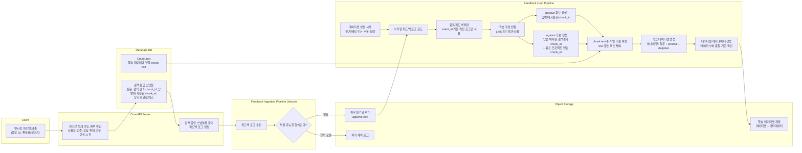

# Feedback Log to Dataset Data Flow

```mermaid
flowchart LR
    subgraph Client["Client"]
        Feedback["명시적 피드백 제출<br/>(응답 ID, 좋아요/싫어요)"]
    end

    subgraph CoreAPI["Core API Server"]
        Validate["피드백 적재 가능 여부 확인<br/>사용자 인증, 응답 존재 여부, 만료 시간"]
        BuildEvent["검색 응답 스냅샷을 붙여<br/>피드백 로그 생성"]
    end

    subgraph MetadataDB["Metadata DB"]
        SearchSnapshot["검색 응답 스냅샷<br/>질문, 검색 결과 chunk_id, 답변에 사용된 chunk_id,<br/>당시 모델/인덱스"]
        ChunkText["Chunk.text<br/>학습 데이터에 넣을 chunk text"]
    end

    subgraph FIP["Feedback Ingestion Pipeline (Vector)"]
        Receive["피드백 로그 수신"]
        Route{"저장 가능한 형식인가?"}
    end

    subgraph Storage["Object Storage"]
        RawLog["원본 피드백 로그<br/>append-only"]
        ErrorLog["처리 제외 로그"]
        Dataset["학습 데이터셋 저장<br/>데이터셋 + 메타데이터"]
    end

    subgraph Worker["Feedback Loop Pipeline"]
        Trigger["데이터셋 생성 시작<br/>정기 배치 또는 수동 실행"]
        ReadLogs["누적된 피드백 로그 로드"]
        Dedupe["중복 피드백 제거<br/>event_id 기준 최신 로그만 사용"]
        KeepLike["학습 대상 선별<br/>LIKE 피드백만 사용"]
        Positive["positive 후보 생성<br/>답변에 사용된 chunk_id"]
        Negative["negative 후보 생성<br/>답변 미사용 검색결과 chunk_id<br/>+ 같은 프로젝트 랜덤 chunk_id"]
        AttachText["chunk text 추가 및 후보 확정<br/>text 없는 후보 제외"]
        BuildRows["학습 데이터셋 생성<br/>하나의 행: 질문 + positive + negative "]
        Summarize["데이터셋 메타데이터 생성<br/>데이터 수와 품질 기준 확인"]
    end

    Feedback --> Validate
    Validate --> SearchSnapshot
    SearchSnapshot --> BuildEvent
    BuildEvent --> Receive
    Receive --> Route
    Route -->|"정상"| RawLog
    Route -->|"형식 오류"| ErrorLog

    Trigger --> ReadLogs
    RawLog --> ReadLogs
    ReadLogs --> Dedupe
    Dedupe --> KeepLike
    KeepLike --> Positive
    KeepLike --> Negative
    Positive --> AttachText
    Negative --> AttachText
    ChunkText --> AttachText
    AttachText --> BuildRows
    BuildRows --> Summarize
    Summarize --> Dataset
```
