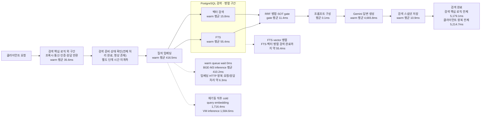

# 검색 흐름 Value Stream Map 초안

- 상태: 초안
- 기준 표본: 2026-08-02 검색 VM 재기동 후 동일 질의 5회와 선행 cold 표본 1건
- 목적: 현재 검색 경로의 처리 시간과 대기를 나란히 보고, 후속 부하 측정의 기준선을 정한다.

## 결론

재기동 직후 첫 질의 임베딩은 **1.716초**, 이후 4회는 평균 **416.5ms**였다. VM 내부에서도 첫 BGE-M3 추론은 **1.585초**, 이후 4회 평균은 **410.2ms**였으며 모든 요청의 슬롯 대기는 0ms였다. 첫 요청만 느리고 2회차부터 과거 기준선 417~431ms로 복귀했으므로, 앞서 관측한 질의 임베딩 2.386초도 **재기동 후 첫 추론의 lazy 초기화가 포함된 cold 표본**으로 판정한다.

정상 warm 검색 4회의 Search Service 평균은 **5.179초**, Frontend 경유 평균은 **5.215초**다. 이 중 LLM 평균이 **4.666초(90.1%)**, 질의 임베딩 평균이 **416.5ms(8.0%)**다. DB 검색은 병렬 구간 약 55ms 수준으로 사용자 체감 시간을 지배하지 않았다.

재기동 직후 전체 첫 요청은 클라이언트 15.205초, Search Service 내부 5.710초였다. 약 9.5초는 Search timing 진입 전에 발생했으며 Frontend 또는 Search Cloud Run의 첫 요청 준비 시간으로 보인다. 정확한 위치는 아직 분해되지 않았다.

## 측정 조건

| 항목 | 값 |
|---|---|
| 측정 시각 | 선행 cold 18:31:23, 재기동 검증 20:00:22~20:00:59 KST |
| GCP 프로젝트·서비스 리전 | `project-ed2d3cb0-7d1e-43ef-bb6` · `asia-northeast3` |
| 호출 경로 | Frontend `/api/v1/search` 프록시 → Search Service |
| Search Service revision | `search-service-00036-g4g` |
| Search Service image | `search-service:fe1d43f-r1` |
| 검색 프로젝트 | `b679b349-3e89-4836-bc2c-5e7fe6d2ab66` |
| 질의 | `플랙 아머의 특징을 설명해줘` |
| 검색 대상 | serving target 1개, READY 영상이 있는 프로젝트 |
| 동일 콘텐츠 영상 | `390a07e8-9c80-4bb7-a6a8-1e2915ba6fc0` · `플랙아머설정` |
| 검색 결과 | 청크 5개. 1·2순위가 동일 콘텐츠 영상 |
| 요청·trace | `bf344911-2e7e-432c-9a8b-f92b10ffee0d` · `8028c004-4016-4e13-a688-232804ff1e7a` |
| 검색 임베딩 VM | `biblio-perf-ed2d3cb0-embedding-search`, BGE-M3 CPU 추론 |
| 표본 수 | 재기동 후 연속 5회, 선행 cold 1회 |

오늘 새로 업로드한 원본 프로젝트 `aa76f74d-8f44-4a98-9fbd-b63c4daf4713`는 검색 시점에 `SEARCH_NOT_READY`를 반환했다. 원본 상태를 변경하지 않고, 같은 `플랙 아머` 콘텐츠가 이미 READY인 프로젝트를 검색했다. 따라서 **콘텐츠와 질의는 같지만 video ID는 다르다.**

검색 API는 영상 하나가 아니라 프로젝트 전체를 검색한다. 반환된 5개 청크 중 상위 2개가 `플랙아머설정` 영상이었고, 나머지 3개는 같은 프로젝트의 다른 영상이었다.

## Cold·warm 재측정 결과

동일한 프로젝트와 질의를 사용해 검색 VM 재기동 후 5회 연속 실행했다.

| 회차 | Frontend 경유 전체 | Search Service 전체 | Query embedding | VM inference | Queue wait | LLM |
|---:|---:|---:|---:|---:|---:|---:|
| 1 · cold | 15,205.3ms | 5,709.7ms | 1,716.4ms | 1,584.6ms | 0ms | 3,785.3ms |
| 2 · warm | 6,426.0ms | 6,393.2ms | 421.4ms | 415.1ms | 0ms | 5,863.4ms |
| 3 · warm | 5,033.2ms | 5,027.3ms | 416.7ms | 409.6ms | 0ms | 4,517.0ms |
| 4 · warm | 4,472.7ms | 4,409.9ms | 412.7ms | 406.8ms | 0ms | 3,904.4ms |
| 5 · warm | 4,926.7ms | 4,885.9ms | 415.1ms | 409.2ms | 0ms | 4,378.2ms |
| **Warm 평균** | **5,214.7ms** | **5,179.1ms** | **416.5ms** | **410.2ms** | **0ms** | **4,665.8ms** |

재기동 후 첫 VM 추론은 warm 평균보다 약 **3.9배** 느렸다. Search Service의 질의 임베딩도 첫 회 1,716.4ms에서 2회차 421.4ms로 즉시 내려갔다. 모델·VM·입력 길이는 같고 queue wait도 모두 0ms이므로, 큐 적체·입력 크기·네트워크가 아니라 첫 `encode()`의 lazy 초기화가 원인이다.

선행 cold 표본은 Search query embedding 2,385.8ms, VM inference 2,176.0ms였다. 첫 추론 비용은 이번 재측정의 1,584.6ms와 완전히 같은 값은 아니지만, warm 410ms대보다 일관되게 느렸다.

## Value Stream Map · warm 기준선

## 선행 cold 표본 단계별 시간

| 순서 | 구간 | 실측 | Search Service 전체 비중 | 실행·대기 해석 |
|---:|---|---:|---:|---|
| 0 | Frontend 프록시·서비스 간 통신 | 약 75.0ms | Search Service 외부 | Client 8,365.2ms와 Search Service 8,290.2ms의 차이다. 네트워크와 직렬화는 분리되지 않았다. |
| 1 | 준비 상태 확인 | 별도 미계측 | - | READY와 serving target을 PostgreSQL에서 확인한다. DB connection acquire는 5.2ms였다. |
| 2 | 질의 임베딩 | 2,385.8ms | 28.8% | VM queue wait 0ms, BGE-M3 inference 2,176.0ms다. 나머지 약 209.8ms에는 HTTP·직렬화와 양쪽 애플리케이션 처리가 포함된다. |
| 3a | FTS | 88.7ms | 병렬 구간 | PostgreSQL connection acquire 3.9ms를 포함한다. |
| 3b | 벡터 검색 | 98.6ms | 병렬 구간 | PostgreSQL connection acquire 48.5ms를 포함한다. FTS와 동시에 실행돼 두 시간을 합산하지 않는다. |
| 3 | **검색 병렬 구간 벽시계** | **약 98.6ms** | **약 1.2%** | 두 작업이 거의 동시에 시작했다고 보고 더 긴 벡터 검색 시간을 대표값으로 사용했다. 별도 `retrieve_ms` 계측은 없다. |
| 4 | RRF 병합·SOT gate | gate 17.2ms | 0.2% | RRF 병합 시간은 별도 계측되지 않았다. SOT gate connection acquire는 2.8ms였다. |
| 5 | 프롬프트 구성 | 0.1ms | 0.0% | 검색 청크를 LLM 입력으로 조립한다. |
| 6 | LLM 답변 생성 | 5,745.3ms | 69.3% | Gemini 호출과 응답 파싱을 합친 시간이다. |
| 7 | 검색 스냅샷 저장 | 19.8ms | 0.2% | connection acquire 5.5ms를 포함한다. |
| 8 | 기타 | 약 23.4ms | 약 0.3% | 준비 상태 확인, RRF 병합, 청크 조립, 대화 저장, orchestration 등 별도 계측되지 않은 시간을 합친 추정 잔여값이다. |
|  | **Search Service 전체** | **8,290.2ms** | **100%** | `search.execute.timing`의 `total_ms`다. |
|  | **Frontend 경유 전체** | **8,365.2ms** | Search Service 외부 포함 | 테스트 클라이언트에서 잰 HTTP 왕복 시간이다. |

FTS 88.7ms와 벡터 검색 98.6ms는 각각의 작업 시간이다. 코드는 두 작업을 `asyncio.gather`로 동시에 실행하므로 VSM의 전체 시간에는 약 98.6ms만 반영했다. 이 때문에 개별 timing 필드를 단순 합산하면 `total_ms`보다 커진다.

## 선행 cold 표본의 처리 시간과 대기 시간

| 구간 | 확인된 처리 | 확인된 대기 | 아직 모르는 것 |
|---|---|---|---|
| 질의 임베딩 | BGE-M3 inference 2,176.0ms | 실행 슬롯 queue wait 0ms | HTTP·직렬화 등 약 209.8ms의 세부 구성 |
| FTS | 전체 88.7ms | DB connection acquire 3.9ms | SQL 실행·결과 변환 각각의 시간 |
| 벡터 검색 | 전체 98.6ms | DB connection acquire 48.5ms | exact KNN SQL 실행·결과 변환 각각의 시간 |
| SOT gate | 전체 17.2ms | DB connection acquire 2.8ms | SQL 실행·결과 변환 각각의 시간 |
| LLM | 전체 5,745.3ms | 원격 Gemini 응답 대기가 포함됨 | 네트워크·모델 처리·응답 파싱 각각의 시간 |
| 응답 저장 | snapshot 19.8ms | snapshot acquire 5.5ms, conversation acquire 2.6ms | 대화 저장 전체 시간과 commit 시간 |

## 재측정에서 보이는 병목 후보

1. **LLM 호출** — warm 4회 평균 4.666초로 Search Service 시간의 90.1%다. 사용자 체감 검색 시간에는 가장 큰 구간이지만, 검색 인프라 부하테스트에서는 mock 또는 별도 지표로 분리해야 한다.
2. **재기동 후 첫 임베딩** — 첫 VM 추론은 1.585초, warm 평균은 410.2ms였다. 현재 startup 경로에 사전 `encode()`가 없어 첫 사용자 요청이 lazy 초기화 비용을 부담한다.
3. **Frontend·Search 첫 요청 경로** — 재기동 검증 첫 요청에서 Client와 Search timing 사이에 약 9.5초가 있었다. 임베딩과 별개이며 Frontend 프록시 또는 Search Cloud Run의 timing 진입 전 구간을 분해해야 한다.
4. **DB 검색** — warm 4회에서 FTS 평균 55.4ms, 벡터 검색 평균 15.8ms였고 병렬 실행됐다. 오늘 warm 사용자 체감 시간은 지배하지 않았지만 코퍼스와 동시 요청이 늘 때는 다시 판정해야 한다.

## 결과 품질에서 확인된 문제

선행 cold 요청은 HTTP 200으로 성공했고 답변 1,270자와 청크 5개를 반환했다. 다만 `search.llm_answer_fallback`이 발생해 LLM 응답의 구조화 블록을 읽지 못했고, 모든 청크의 `used`가 `false`로 남았다. 이는 latency 측정을 무효로 만들지는 않지만, 출처 사용 표시의 정확성 문제로 별도 추적해야 한다.

## 다음 측정에서 보완할 항목

- endpoint 시작 시 대표 질의 `encode()` 1회로 warm-up할지 결정하고, 적용하면 startup readiness와 실패 처리 정책을 정한다.
- 현재 4회인 warm 표본을 늘려 p50·p95를 구한다.
- LLM을 제외한 검색 경로를 mock 조건으로 측정해 질의 임베딩·FTS·벡터 검색의 처리량 한계를 분리한다.
- `retrieve_ms`, readiness, conversation save를 직접 계측해 약 23.4ms의 잔여값을 없앤다.
- Frontend와 Search Service의 요청 시작 시각을 함께 기록해 첫 요청의 약 9.5초를 프록시·Cloud Run startup·middleware로 분해한다.
- 동시 검색에서 임베딩 queue wait·503과 DB connection acquire의 증가를 함께 기록한다.
- 코퍼스 청크 수를 조건에 기록하고 1천·1만·5만 청크에서 FTS·벡터 검색 시간을 비교한다.
- LLM 구조화 응답 fallback 원인을 확인해 `used` 출처 표시를 복구한다.

## 사용 범위

- 이 문서는 오늘 현재 검색 경로의 **초기 VSM**이며 cold와 warm을 분리한다.
- 정상 임베딩 기준선은 warm 4회 평균 416.5ms다. 1.716~2.386초는 재기동 직후 cold 범위로만 사용한다.
- warm 표본도 4회뿐이므로 p50·p95·처리량으로 일반화하지 않는다.
- 원본 업로드 프로젝트가 READY가 아니어서 같은 콘텐츠의 READY 사본을 사용했다.
- #104 병목 판정에서는 LLM 포함 사용자 체감 시간과 LLM 제외 검색 인프라 시간을 분리한다.

## 근거

- 현재 배포 구조: `docs/Diagram/Deployment_Diagram_Search_Current.md`
- 검색 전체 흐름: `services/search-service/src/services/search_orchestrator.py:128`
- 질의 임베딩: `services/search-service/src/services/search_orchestrator.py:208`
- FTS·벡터 검색 병렬 실행: `services/search-service/src/services/search_orchestrator.py:241`
- 단계별 timing: `services/search-service/src/services/search_observability.py`
- 선행 cold Search 로그: request `bf344911-2e7e-432c-9a8b-f92b10ffee0d`, trace `8028c004-4016-4e13-a688-232804ff1e7a`
- 재기동 검증 Search 요청: `61427185-d596-4b83-9f16-153486566710`, `ec21596d-5fb9-4d3a-a62e-eb8ec8bbb153`, `7ee31808-bbb1-49fc-be15-1bcf8dbf2600`, `669753e3-cccd-4f20-8481-7c8a0738c5fe`, `e3b34368-2cbb-4dc0-a4be-80547089a1ad`
- 검색 임베딩 VM 근거: 각 요청 trace의 `embedding.admission`, `embed.success`
