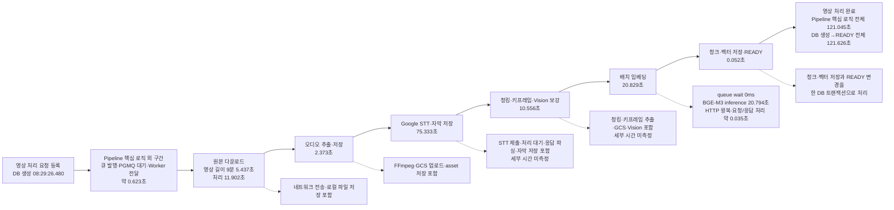

# 영상 처리 Value Stream Map 초안

- 상태: 초안
- 기준 표본: 2026-07-28 영상 처리 유효 표본 1건
- 목적: 현재 영상 색인 경로에서 처리 시간과 대기 시간을 나란히 보고, 후속 측정 대상을 정한다.

## 결론

영상이 DB에 생성된 뒤 `READY`가 되기까지 약 **121.626초**가 걸렸다. Pipeline Worker 내부 계측 시간은 **121.045초**다.

가장 긴 구간은 STT 75.333초(62.2%)다. 우리 인프라 안에서 가장 긴 구간은 배치 임베딩 20.829초(17.2%)이며, 그중 실제 배치 VM 추론이 20.794초이고 슬롯 대기는 0ms였다. 이 표본에서는 큐 적체보다 외부 STT 처리와 단일 슬롯 임베딩 추론이 전체 시간을 지배했다.

## 측정 조건

| 항목 | 값 |
|---|---|
| GCP 프로젝트·리전 | `project-ed2d3cb0-7d1e-43ef-bb6` · `asia-northeast3` |
| Pipeline Worker revision | `pipeline-worker-00052-b7j` |
| 기준 커밋 | `67036a7` |
| 영상 | YouTube 영상 1건 |
| 영상 ID | `7599863c-8bf8-4585-a87c-88c90c7b1b92` |
| 영상 길이 | 추출 오디오 기준 545,437ms · 9분 5.437초 |
| 생성·READY 시각 | `08:29:26.479701` · `08:31:28.105801` |
| Pipeline Worker | Cloud Run 1대, 측정 중 min 1 |
| 배치 임베딩 VM | `10.20.3.14`, `e2-standard-4`, BGE-M3 CPU 추론, 실행 슬롯 1 |
| 검색 임베딩 VM | `10.20.3.15`, 배치 VM과 분리 |
| 청킹·임베딩 설정 | 최대 300어절, 배치 크기 4 |
| 결과 데이터 | 청크 4개, enriched text 평균 1,299.5자 |
| 함께 발생한 부하 | 검색 8건. 그중 2건이 영상 임베딩 구간과 겹침 |
| 표본 수 | 1회 |

현재 배포와 같은 VM 분리 구조, 청크 크기, 임베딩 배치 크기를 사용했다. 다만 순수 무부하 표본은 아니다. 검색 요청 8건 중 2건이 영상 임베딩과 겹친 **낮은 `둘 다` 부하** 조건이다. 검색과 영상 임베딩은 서로 다른 VM을 사용했고, 두 검색 요청과 영상 요청 모두 임베딩 슬롯 대기 0ms였다.

## Value Stream Map

## 단계별 시간

| 순서 | 구간 | Pipeline 실측 | 전체 Pipeline 비중 | 실행·대기 해석 |
|---:|---|---:|---:|---|
| 0 | DB 생성 → Worker dispatch | 약 0.623초 | Pipeline 외부 | PGMQ 발행, poll, 메시지 전달과 처리 진입을 합친 값이다. 세부 분해는 없다. |
| 1 | 원본 다운로드 | 11.902초 | 9.8% | 네트워크 전송과 로컬 파일 쓰기가 섞여 있다. |
| 2 | 오디오 추출·저장 | 2.373초 | 2.0% | FFmpeg 처리, GCS 업로드, asset 저장이 섞여 있다. |
| 3 | STT·자막 저장 | 75.333초 | 62.2% | Google STT 제출·처리 대기·응답 파싱·자막 저장이 섞여 있다. Worker가 실제로 CPU를 사용한 시간은 분리되지 않았다. |
| 4 | 청킹·키프레임·Vision 보강 | 10.556초 | 8.7% | 청킹, FFmpeg 키프레임 추출, GCS 업로드, Vision 호출, asset 저장이 섞여 있다. 청크 동시성은 2다. |
| 5 | 배치 임베딩 | 20.829초 | 17.2% | 배치 VM queue wait 0ms, BGE-M3 추론 20.794초다. Pipeline 구간과 추론의 차이는 약 35ms다. |
| 6 | 청크·벡터 저장·READY | 0.052초 | 0.04% | 청크와 벡터를 저장하고 영상 상태를 `READY`로 바꾸는 트랜잭션이다. |
|  | **Pipeline 합계** | **121.045초** | **100%** | 단계별 시간의 합과 일치한다. |
|  | **DB 생성 → READY** | **121.626초** | Pipeline 외부 포함 | DB 시각 기준의 사용자 요청 이후 처리 시간이다. |

## 처리 시간과 대기 시간 판정

현재 로그만으로 실행 시간과 대기 시간을 완전히 분리할 수는 없다.

| 구간 | 확인된 처리 | 확인된 대기 | 아직 모르는 것 |
|---|---|---|---|
| PGMQ | Worker dispatch 시각 | DB 생성부터 dispatch까지 약 0.623초 | enqueue 완료 시각, 실제 poll 대기, 처리권 획득 시간 |
| STT | 전체 구간 75.333초 | Google 장기 작업 완료를 기다리는 구간이 포함됨 | 업로드·submit·poll·Google 처리·파싱·DB 저장 각각의 시간 |
| 청크 보강 | 전체 구간 10.556초 | Vision·GCS 응답 대기가 포함됨 | 청킹, 키프레임, GCS, Vision을 나눈 시간 |
| 임베딩 | BGE-M3 추론 20.794초 | 임베딩 슬롯 대기 0ms | Worker CPU 유휴율. 코드는 HTTP 응답을 기다리지만 Cloud Run CPU 실측은 없음 |
| DB 저장 | 전체 구간 0.052초 | 별도 대기 계측 없음 | 커넥션 획득과 SQL 실행 시간의 분리 |

따라서 “임베딩 중 Worker가 20.794초 동안 완전히 놀았다”고 단정하지 않는다. 확인된 사실은 Pipeline Worker가 원격 임베딩 요청의 반환을 약 20.8초 기다렸다는 것이다. CPU 유휴 여부는 같은 시간대 Cloud Run CPU 사용률로 확인해야 한다.

## 이 표본에서 보이는 병목 후보

1. **STT 외부 처리** — 전체의 62.2%로 가장 길다. 다만 외부 서비스이므로 #104의 직접 개선 대상에서는 제외하고 변동 요인으로 기록한다.
2. **배치 임베딩 단일 슬롯** — 우리 인프라에서 가장 긴 단일 구간이다. 이 표본은 청크 4개가 한 배치에 들어가 추론 1회로 끝났다. 청크가 늘면 `ceil(청크 수 / 4)`에 따라 이 구간이 계단식으로 늘어날 가능성이 있다.
3. **청크 보강 내부 구간** — 10.556초 안에 CPU 작업과 외부 대기가 섞여 있어 현재 값만으로 개선 지점을 고를 수 없다.
4. **큐와 최종 DB 저장** — 이번 단일 표본에서는 각각 약 0.623초와 0.052초로 전체 시간을 지배하지 않았다.

## 다음 측정에서 보완할 항목

- STT의 submit·operation wait·parse·DB 저장 시간을 나눈다.
- 청크 보강의 청킹·키프레임 추출·GCS 업로드·Vision 호출 시간을 나눈다.
- 임베딩 구간과 같은 시간축에서 Pipeline Worker와 배치 임베딩 VM CPU를 확인한다.
- 영상 길이, 청크 수, 임베딩 배치 수를 매 표본에 기록한다.
- 일반 실패에도 완료된 단계와 `total_ms`가 남도록 `pipeline.timing` 실패 로그를 보완할지 별도로 판단한다.
- 순수 색인 기준선이 필요해지면 검색 요청 없이 같은 조건으로 1회 다시 측정한다.

## 사용 범위

- 이 문서는 현재 영상 처리 경로의 **초기 VSM 초안**으로 사용한다.
- 단일 표본이므로 p50·p95·처리량으로 일반화하지 않는다.
- 121.045초는 검색 2건이 임베딩과 겹친 낮은 `둘 다` 조건의 값이다.
- 검색만·색인만·둘 다 부하테스트 결과가 나오면 이 문서의 기준선과 별도로 비교한다.

## 근거

- 실험 원자료: `/home/artyom9/project/agent_memory/문제 정의 및 해결 과정 log/(source)2026-07-28-임베딩-VM-분리-재실험-원자료.md`
- 현재 배포 구조: `docs/Diagram/Deployment_Diagram_Video_Processing_Current.md`
- Pipeline 단계와 timing: `services/pipeline-worker/src/services/pipeline_orchestrator.py:107`, `:508`
- 청킹·키프레임·Vision 보강: `services/pipeline-worker/src/services/pipeline_orchestrator.py:389`
- 순차 배치 임베딩: `services/pipeline-worker/src/services/pipeline_orchestrator.py:455`
- 최종 청크·벡터 저장: `services/pipeline-worker/src/infra/db/artifact_repository.py:210`
