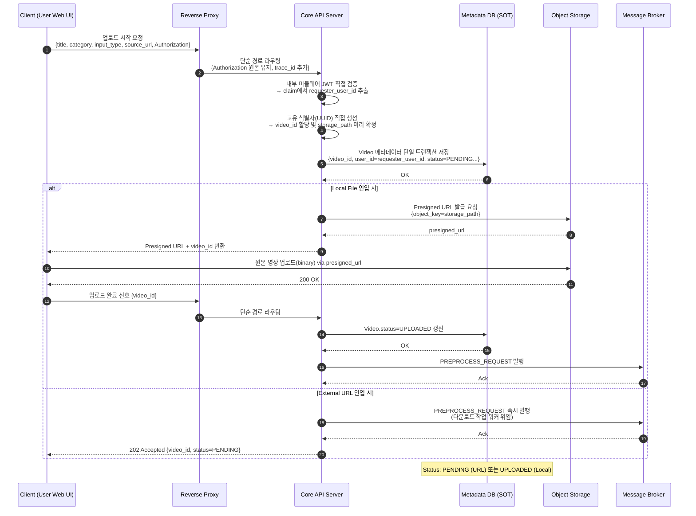
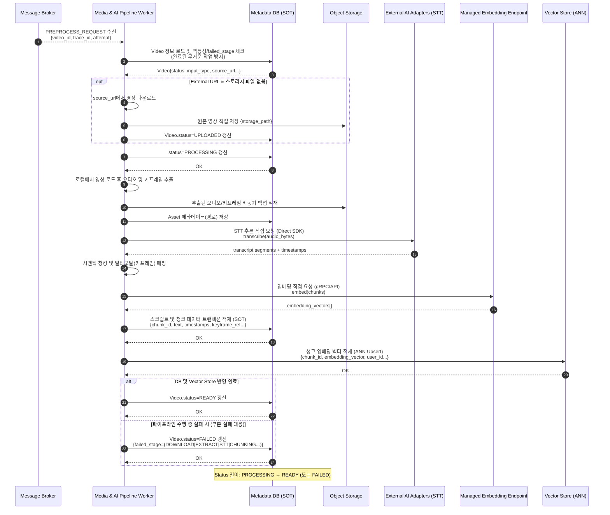
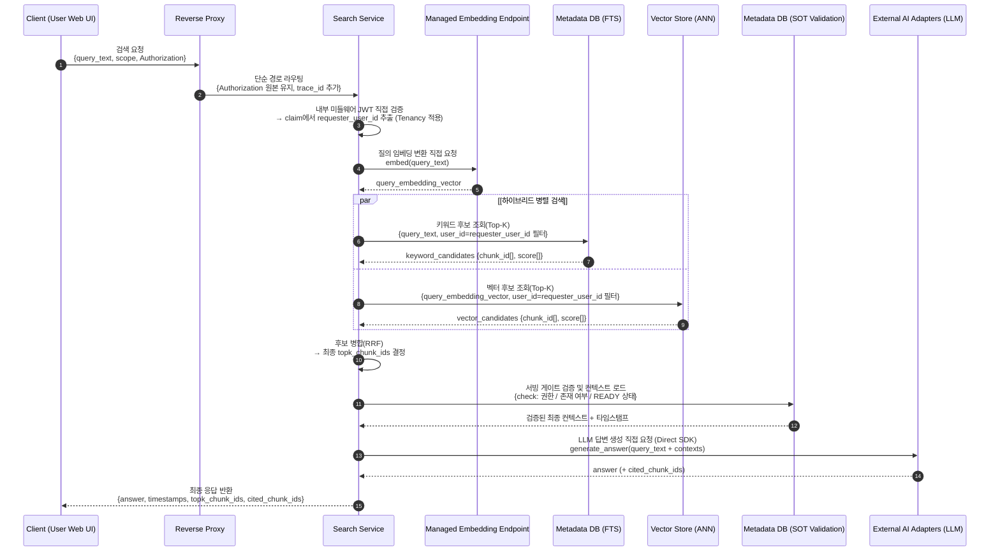
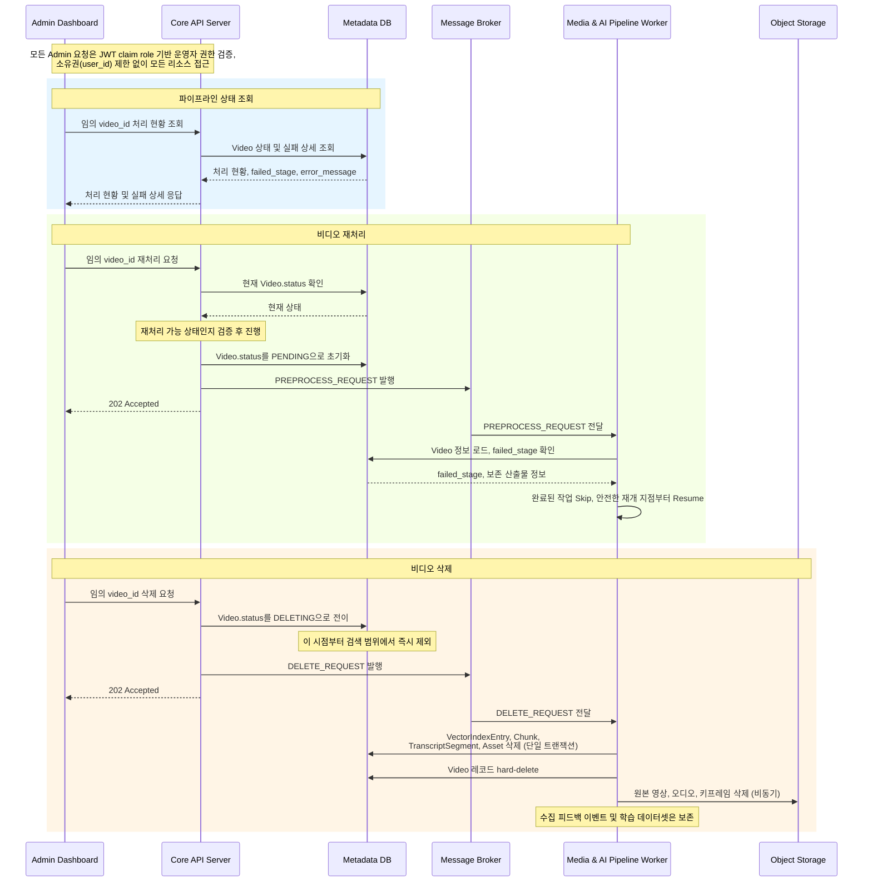
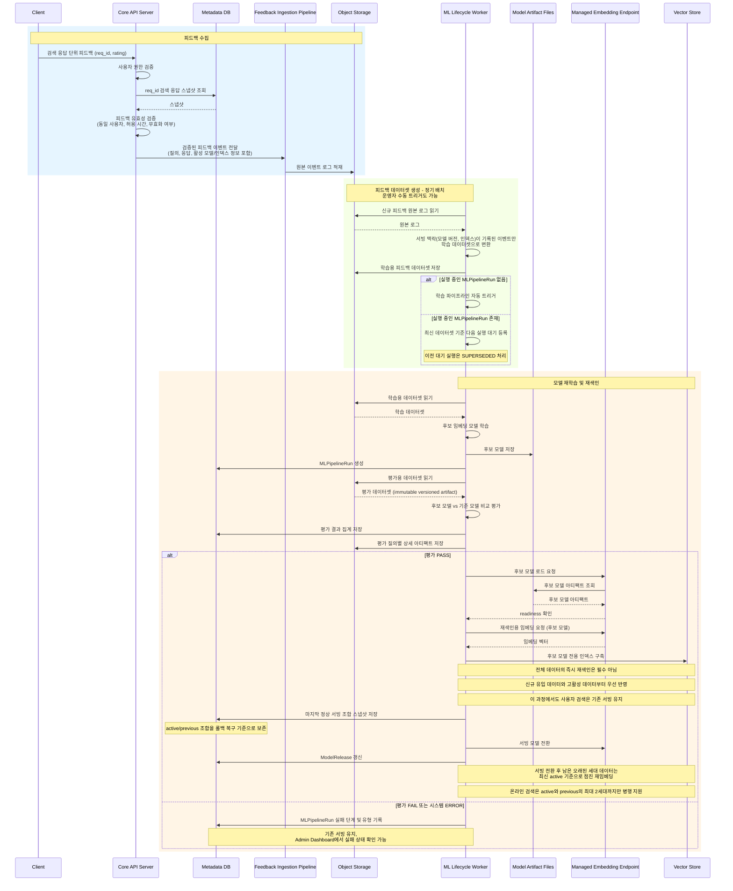

# 1. Video Ingest (Local File & External URL )

```mermaid
sequenceDiagram
autonumber
participant C as Client (User Web UI)
participant RP as Reverse Proxy
participant API as Core API Server
participant DB as Metadata DB (SOT)
participant OS as Object Storage
participant MQ as Message Broker

C->>RP: 업로드 시작 요청<br/>{title, category, input_type, source_url, Authorization}
RP->>API: 단순 경로 라우팅<br/>{Authorization 원본 유지, trace_id 추가}
API->>API: 내부 미들웨어 JWT 직접 검증<br/>→ claim에서 requester_user_id 추출

API->>API: 고유 식별자(UUID) 직접 생성<br/>→ video_id 할당 및 storage_path 미리 확정

API->>DB: Video 메타데이터 단일 트랜잭션 저장<br/>{video_id, user_id=requester_user_id, status=PENDING...}
DB-->>API: OK

alt Local File 인입 시
    API->>OS: Presigned URL 발급 요청<br/>{object_key=storage_path}
    OS-->>API: presigned_url
    API-->>C: Presigned URL + video_id 반환
    
    C->>OS: 원본 영상 업로드(binary) via presigned_url
    OS-->>C: 200 OK
    
    C->>RP: 업로드 완료 신호 {video_id}
    RP->>API: 단순 경로 라우팅
    API->>DB: Video.status=UPLOADED 갱신
    DB-->>API: OK
    
    API->>MQ: PREPROCESS_REQUEST 발행
    MQ-->>API: Ack
else External URL 인입 시
    API->>MQ: PREPROCESS_REQUEST 즉시 발행<br/>(다운로드 작업 워커 위임)
    MQ-->>API: Ack
    API-->>C: 202 Accepted {video_id, status=PENDING}
end

Note over DB: Status: PENDING (URL) 또는 UPLOADED (Local)
```

# 2. Media Processing & AI Indexing

```mermaid
sequenceDiagram
autonumber
participant MQ as Message Broker
participant W as Media & AI Pipeline Worker
participant DB as Metadata DB (SOT)
participant OS as Object Storage
participant STT as External AI Adapters (STT)
participant EMB as Managed Embedding Endpoint
participant VS as Vector Store (ANN)

MQ-->>W: PREPROCESS_REQUEST 수신<br/>{video_id, trace_id, attempt}

W->>DB: Video 정보 로드 및 멱등성/failed_stage 체크<br/>(완료된 무거운 작업 방지)
DB-->>W: Video{status, input_type, source_url...}

opt External URL & 스토리지 파일 없음
    W->>W: source_url에서 영상 다운로드
    W->>OS: 원본 영상 직접 저장 {storage_path}
    W->>DB: Video.status=UPLOADED 갱신
end

W->>DB: status=PROCESSING 갱신
DB-->>W: OK

W->>W: 로컬에서 영상 로드 후 오디오 및 키프레임 추출
W->>OS: 추출된 오디오/키프레임 비동기 백업 적재
W->>DB: Asset 메타데이터(경로) 저장


W->>STT: STT 추론 직접 요청 (Direct SDK)<br/>transcribe(audio_bytes)
STT-->>W: transcript segments + timestamps

W->>W: 시맨틱 청킹 및 멀티모달(키프레임) 매핑

W->>EMB: 임베딩 직접 요청 (gRPC/API)<br/>embed(chunks)
EMB-->>W: embedding_vectors[]

W->>DB: 스크립트 및 청크 데이터 트랜잭션 적재 (SOT)<br/>{chunk_id, text, timestamps, keyframe_ref...}
DB-->>W: OK

W->>VS: 청크 임베딩 벡터 적재 (ANN Upsert)<br/>{chunk_id, embedding_vector, user_id...}
VS-->>W: OK

alt DB 및 Vector Store 반영 완료
  W->>DB: Video.status=READY 갱신
  DB-->>W: OK
else 파이프라인 수행 중 실패 시 (부분 실패 대응)
  W->>DB: Video.status=FAILED 갱신<br/>{failed_stage=(DOWNLOAD|EXTRACT|STT|CHUNKING...)}
  DB-->>W: OK
end

Note over DB: Status 전이: PROCESSING → READY (또는 FAILED)
```

# 3. Search & RAG Serving

```mermaid
sequenceDiagram
autonumber
participant C as Client (User Web UI)
participant RP as Reverse Proxy
participant SS as Search Service
participant EMB as Managed Embedding Endpoint
participant FTS as Metadata DB (FTS)
participant VS as Vector Store (ANN)
participant SOT as Metadata DB (SOT Validation)
participant LLM as External AI Adapters (LLM)

C->>RP: 검색 요청<br/>{query_text, scope, Authorization}
RP->>SS: 단순 경로 라우팅<br/>{Authorization 원본 유지, trace_id 추가}
SS->>SS: 내부 미들웨어 JWT 직접 검증<br/>→ claim에서 requester_user_id 추출 (Tenancy 적용)

SS->>EMB: 질의 임베딩 변환 직접 요청<br/>embed(query_text)
EMB-->>SS: query_embedding_vector

par [하이브리드 병렬 검색]
    SS->>FTS: 키워드 후보 조회(Top-K)<br/>{query_text, user_id=requester_user_id 필터}
    FTS-->>SS: keyword_candidates {chunk_id[], score[]}
and
    SS->>VS: 벡터 후보 조회(Top-K)<br/>{query_embedding_vector, user_id=requester_user_id 필터}
    VS-->>SS: vector_candidates {chunk_id[], score[]}
end

SS->>SS: 후보 병합(RRF)<br/>→ 최종 topk_chunk_ids 결정

SS->>SOT: 서빙 게이트 검증 및 컨텍스트 로드<br/>{check: 권한 / 존재 여부 / READY 상태}
SOT-->>SS: 검증된 최종 컨텍스트 + 타임스탬프

SS->>LLM: LLM 답변 생성 직접 요청 (Direct SDK)<br/>generate_answer(query_text + contexts)
LLM-->>SS: answer (+ cited_chunk_ids)

SS-->>C: 최종 응답 반환<br/>{answer, timestamps, topk_chunk_ids, cited_chunk_ids}
```

# 4. Feedback Loop

```mermaid

sequenceDiagram
    participant Client
    participant CoreAPI as Core API Server
    participant MetaDB as Metadata DB
    participant FIP as Feedback Ingestion Pipeline
    participant ObjStore as Object Storage
    participant MLWorker as ML Lifecycle Worker
    participant ModelFiles as Model Artifact Files
    participant MEE as Managed Embedding Endpoint
    participant VS as Vector Store

    %% === 피드백 수집 (2.6) ===
    rect rgb(230, 245, 255)
    Note over Client, ObjStore: 피드백 수집
    Client ->> CoreAPI: 검색 응답 단위 피드백 (req_id, rating)
    CoreAPI ->> CoreAPI: 사용자 권한 검증
    CoreAPI ->> MetaDB: req_id 검색 응답 스냅샷 조회
    MetaDB -->> CoreAPI: 스냅샷
    CoreAPI ->> CoreAPI: 피드백 유효성 검증<br/>(동일 사용자, 허용 시간, 무효화 여부)
    CoreAPI ->> FIP: 검증된 피드백 이벤트 전달<br/>(질의, 응답, 활성 모델/인덱스 정보 포함)
    FIP ->> ObjStore: 원본 이벤트 로그 적재
    end

    %% === 데이터셋 전처리 (2.7) ===
    rect rgb(245, 255, 230)
    Note over MLWorker, ObjStore: 피드백 데이터셋 생성 - 정기 배치 <br/>운영자 수동 트리거도 가능
    MLWorker ->> ObjStore: 신규 피드백 원본 로그 읽기
    ObjStore -->> MLWorker: 원본 로그
    MLWorker ->> MLWorker: 서빙 맥락(모델 버전, 인덱스)이 기록된 이벤트만<br/>학습 데이터셋으로 변환
    MLWorker ->> ObjStore: 학습용 피드백 데이터셋 저장

    alt 실행 중인 MLPipelineRun 없음
        MLWorker ->> MLWorker: 학습 파이프라인 자동 트리거
    else 실행 중인 MLPipelineRun 존재
        MLWorker ->> MLWorker: 최신 데이터셋 기준 다음 실행 대기 등록
        Note over MLWorker: 이전 대기 실행은 SUPERSEDED 처리
    end
    end

    %% === 모델 재학습 및 재색인 (2.8) ===
    rect rgb(255, 245, 230)
    Note over MLWorker, VS: 모델 재학습 및 재색인

    %% 학습
    MLWorker ->> ObjStore: 학습용 데이터셋 읽기
    ObjStore -->> MLWorker: 학습 데이터셋
    MLWorker ->> MLWorker: 후보 임베딩 모델 학습
    MLWorker ->> ModelFiles: 후보 모델 저장
    MLWorker ->> MetaDB: MLPipelineRun 생성

    %% 평가
    MLWorker ->> ObjStore: 평가용 데이터셋 읽기
    ObjStore -->> MLWorker: 평가 데이터셋 (immutable versioned artifact)
    MLWorker ->> MLWorker: 후보 모델 vs 기준 모델 비교 평가
    MLWorker ->> MetaDB: 평가 결과 집계 저장
    MLWorker ->> ObjStore: 평가 질의별 상세 아티팩트 저장

    alt 평가 PASS
        MLWorker ->> MEE: 후보 모델 로드 요청
        MEE ->> ModelFiles: 후보 모델 아티팩트 조회
        ModelFiles -->> MEE: 후보 모델 아티팩트
        MEE -->> MLWorker: readiness 확인
        MLWorker ->> MEE: 재색인용 임베딩 요청 (후보 모델)
        MEE -->> MLWorker: 임베딩 벡터
        MLWorker ->> VS: 후보 모델 전용 인덱스 구축
        Note over MLWorker, VS: 전체 데이터의 즉시 재색인은 필수 아님
        Note over MLWorker, VS: 신규 유입 데이터와 고활성 데이터부터 우선 반영
        Note over MLWorker, VS: 이 과정에서도 사용자 검색은 기존 서빙 유지
        MLWorker ->> MetaDB: 마지막 정상 서빙 조합 스냅샷 저장
        Note over MetaDB: active/previous 조합을 롤백 복구 기준으로 보존
        MLWorker ->> MEE: 서빙 모델 전환
        MLWorker ->> MetaDB: ModelRelease 갱신<br/>(active=candidate, previous=직전 active)
        Note over MLWorker, VS: 서빙 전환 후 남은 오래된 세대 데이터는<br/>최신 active 기준으로 점진 재임베딩
        Note over MLWorker, VS: 온라인 검색은 active와 previous의 최대 2세대까지만 병행 지원
    else 평가 FAIL 또는 시스템 ERROR
        MLWorker ->> MetaDB: MLPipelineRun 실패 단계 및 유형 기록
        Note over MLWorker, MetaDB: 기존 서빙 유지,<br/>Admin Dashboard에서 실패 상태 확인 가능
    end
    end


```

# 5. Admin_Video_Ops

```mermaid
sequenceDiagram
    participant Admin as Admin Dashboard
    participant CoreAPI as Core API Server
    participant MetaDB as Metadata DB
    participant Broker as Message Broker
    participant PipelineWorker as Media & AI Pipeline Worker
    participant ObjStore as Object Storage

    Note over Admin, CoreAPI: 모든 Admin 요청은 JWT claim role 기반 운영자 권한 검증,<br/>소유권(user_id) 제한 없이 모든 리소스 접근

    %% === 파이프라인 상태 조회 ===
    rect rgb(230, 245, 255)
    Note over Admin, MetaDB: 파이프라인 상태 조회 
    Admin ->> CoreAPI: 임의 video_id 처리 현황 조회 
    CoreAPI ->> MetaDB: Video 상태 및 실패 상세 조회
    MetaDB -->> CoreAPI: 처리 현황, failed_stage, error_message
    CoreAPI -->> Admin: 처리 현황 및 실패 상세 응답
    end

    %% === 재처리 ===
    rect rgb(245, 255, 230)
    Note over Admin, PipelineWorker: 비디오 재처리 
    Admin ->> CoreAPI: 임의 video_id 재처리 요청 
    CoreAPI ->> MetaDB: 현재 Video.status 확인
    MetaDB -->> CoreAPI: 현재 상태
    Note over CoreAPI: 재처리 가능 상태인지 검증 후 진행
    CoreAPI ->> MetaDB: Video.status를 PENDING으로 초기화
    CoreAPI ->> Broker: PREPROCESS_REQUEST 발행
    CoreAPI -->> Admin: 202 Accepted
    Broker ->> PipelineWorker: PREPROCESS_REQUEST 전달
    PipelineWorker ->> MetaDB: Video 정보 로드, failed_stage 확인
    MetaDB -->> PipelineWorker: failed_stage, 보존 산출물 정보
    PipelineWorker ->> PipelineWorker: 완료된 작업 Skip, 안전한 재개 지점부터 Resume
    end

    %% === 삭제 ===
    rect rgb(255, 245, 230)
    Note over Admin, ObjStore: 비디오 삭제 
    Admin ->> CoreAPI: 임의 video_id 삭제 요청 
    CoreAPI ->> MetaDB: Video.status를 DELETING으로 전이
    Note over MetaDB: 이 시점부터 검색 범위에서 즉시 제외
    CoreAPI ->> Broker: DELETE_REQUEST 발행
    CoreAPI -->> Admin: 202 Accepted
    Broker ->> PipelineWorker: DELETE_REQUEST 전달
    PipelineWorker ->> MetaDB: VectorIndexEntry, Chunk,<br/>TranscriptSegment, Asset 삭제 (단일 트랜잭션)
    PipelineWorker ->> MetaDB: Video 레코드 hard-delete
    PipelineWorker ->> ObjStore: 원본 영상, 오디오, 키프레임 삭제 (비동기)
    Note over PipelineWorker: 수집 피드백 이벤트 및 학습 데이터셋은 보존
    end
```

# 6. Admin_ML_ops

```mermaid

sequenceDiagram
    participant Client
    participant CoreAPI as Core API Server
    participant MetaDB as Metadata DB
    participant FIP as Feedback Ingestion Pipeline
    participant ObjStore as Object Storage
    participant MLWorker as ML Lifecycle Worker
    participant ModelFiles as Model Artifact Files
    participant MEE as Managed Embedding Endpoint
    participant VS as Vector Store

    %% === 피드백 수집 (2.6) ===
    rect rgb(230, 245, 255)
    Note over Client, ObjStore: 피드백 수집
    Client ->> CoreAPI: 검색 응답 단위 피드백 (req_id, rating)
    CoreAPI ->> CoreAPI: 사용자 권한 검증
    CoreAPI ->> MetaDB: req_id 검색 응답 스냅샷 조회
    MetaDB -->> CoreAPI: 스냅샷
    CoreAPI ->> CoreAPI: 피드백 유효성 검증<br/>(동일 사용자, 허용 시간, 무효화 여부)
    CoreAPI ->> FIP: 검증된 피드백 이벤트 전달<br/>(질의, 응답, 활성 모델/인덱스 정보 포함)
    FIP ->> ObjStore: 원본 이벤트 로그 적재
    end

    %% === 데이터셋 전처리 (2.7) ===
    rect rgb(245, 255, 230)
    Note over MLWorker, ObjStore: 피드백 데이터셋 생성 - 정기 배치 <br/>운영자 수동 트리거도 가능
    MLWorker ->> ObjStore: 신규 피드백 원본 로그 읽기
    ObjStore -->> MLWorker: 원본 로그
    MLWorker ->> MLWorker: 서빙 맥락(모델 버전, 인덱스)이 기록된 이벤트만<br/>학습 데이터셋으로 변환
    MLWorker ->> ObjStore: 학습용 피드백 데이터셋 저장

    alt 실행 중인 MLPipelineRun 없음
        MLWorker ->> MLWorker: 학습 파이프라인 자동 트리거
    else 실행 중인 MLPipelineRun 존재
        MLWorker ->> MLWorker: 최신 데이터셋 기준 다음 실행 대기 등록
        Note over MLWorker: 이전 대기 실행은 SUPERSEDED 처리
    end
    end

    %% === 모델 재학습 및 재색인 (2.8) ===
    rect rgb(255, 245, 230)
    Note over MLWorker, VS: 모델 재학습 및 재색인

    %% 학습
    MLWorker ->> ObjStore: 학습용 데이터셋 읽기
    ObjStore -->> MLWorker: 학습 데이터셋
    MLWorker ->> MLWorker: 후보 임베딩 모델 학습
    MLWorker ->> ModelFiles: 후보 모델 저장
    MLWorker ->> MetaDB: MLPipelineRun 생성

    %% 평가
    MLWorker ->> ObjStore: 평가용 데이터셋 읽기
    ObjStore -->> MLWorker: 평가 데이터셋 (immutable versioned artifact)
    MLWorker ->> MLWorker: 후보 모델 vs 기준 모델 비교 평가
    MLWorker ->> MetaDB: 평가 결과 집계 저장
    MLWorker ->> ObjStore: 평가 질의별 상세 아티팩트 저장

    alt 평가 PASS
        MLWorker ->> MEE: 후보 모델 로드 요청
        MEE ->> ModelFiles: 후보 모델 아티팩트 조회
        ModelFiles -->> MEE: 후보 모델 아티팩트
        MEE -->> MLWorker: readiness 확인
        MLWorker ->> MEE: 재색인용 임베딩 요청 (후보 모델)
        MEE -->> MLWorker: 임베딩 벡터
        MLWorker ->> VS: 후보 모델 전용 인덱스 구축
        Note over MLWorker, VS: 전체 데이터의 즉시 재색인은 필수 아님
        Note over MLWorker, VS: 신규 유입 데이터와 고활성 데이터부터 우선 반영
        Note over MLWorker, VS: 이 과정에서도 사용자 검색은 기존 서빙 유지
        MLWorker ->> MetaDB: 마지막 정상 서빙 조합 스냅샷 저장
        Note over MetaDB: active/previous 조합을 롤백 복구 기준으로 보존
        MLWorker ->> MEE: 서빙 모델 전환
        MLWorker ->> MetaDB: ModelRelease 갱신
        Note over MLWorker, VS: 서빙 전환 후 남은 오래된 세대 데이터는<br/>최신 active 기준으로 점진 재임베딩
        Note over MLWorker, VS: 온라인 검색은 active와 previous의 최대 2세대까지만 병행 지원
    else 평가 FAIL 또는 시스템 ERROR
        MLWorker ->> MetaDB: MLPipelineRun 실패 단계 및 유형 기록
        Note over MLWorker, MetaDB: 기존 서빙 유지,<br/>Admin Dashboard에서 실패 상태 확인 가능
    end
    end

```