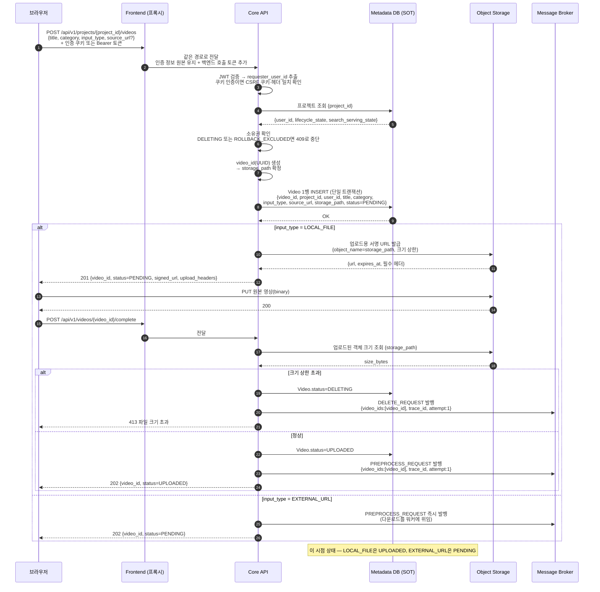
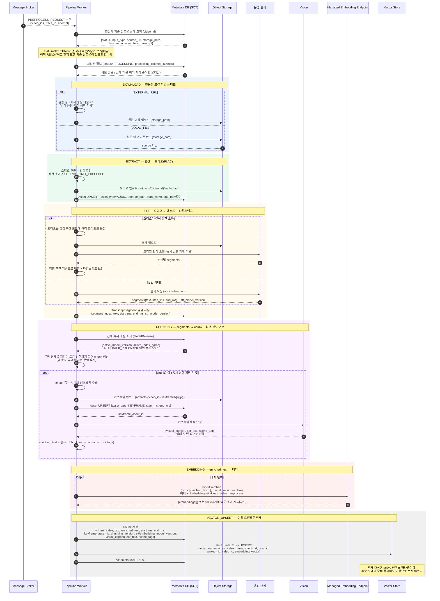
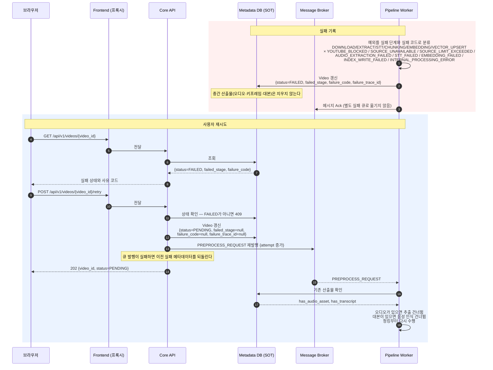
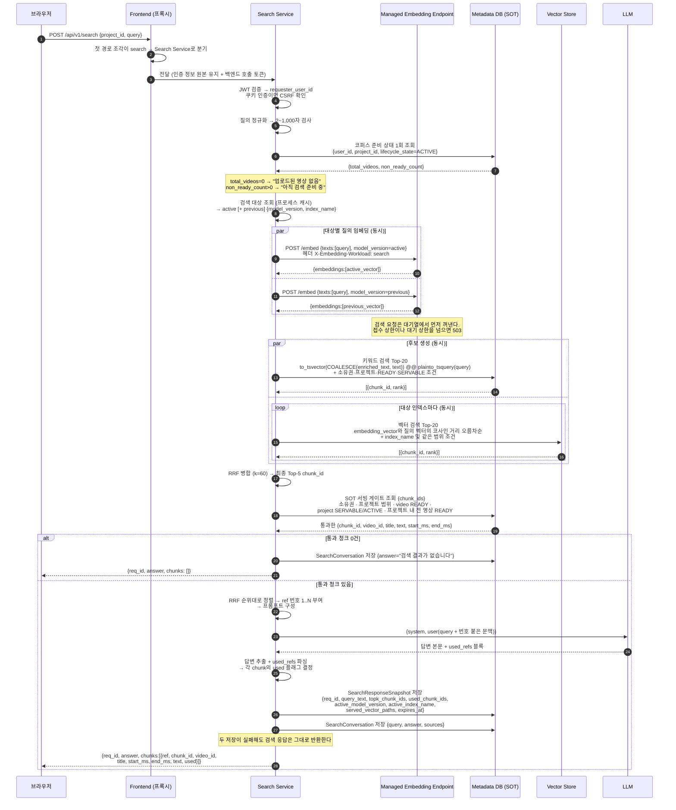
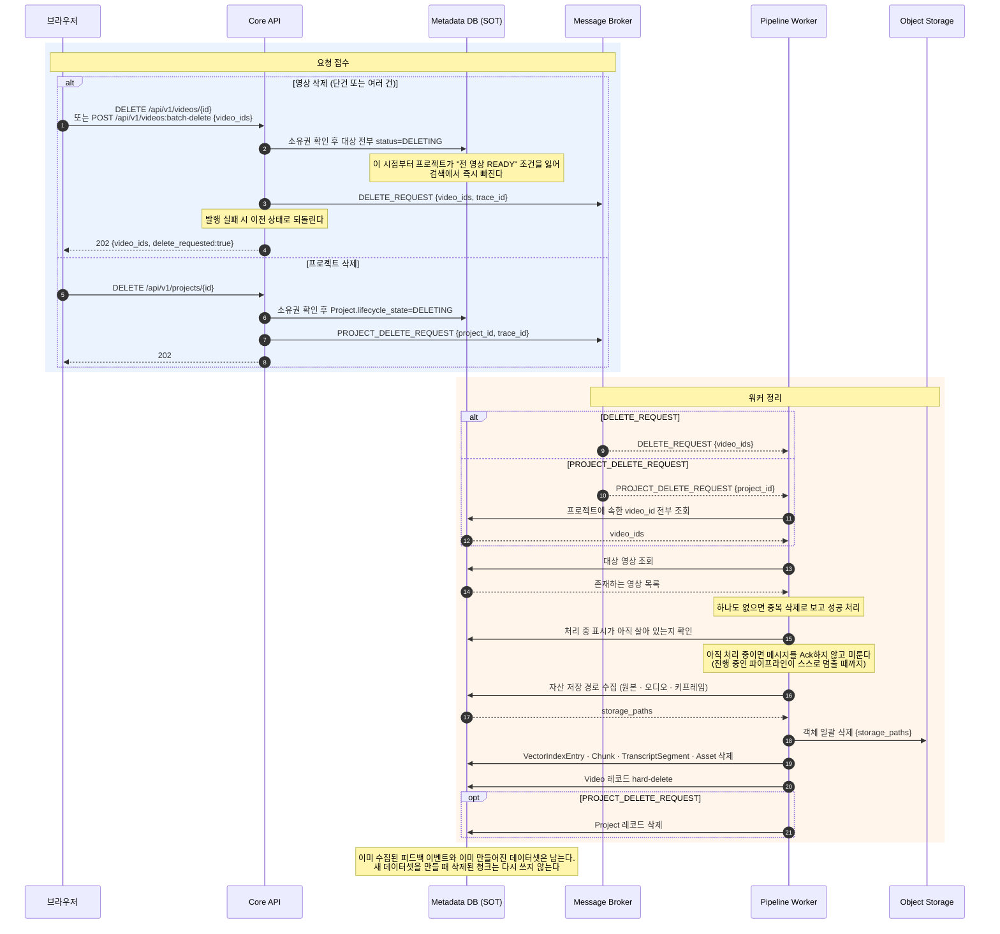
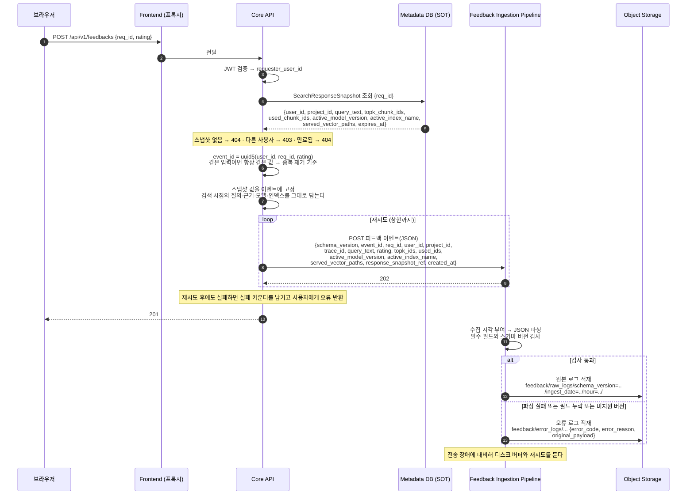
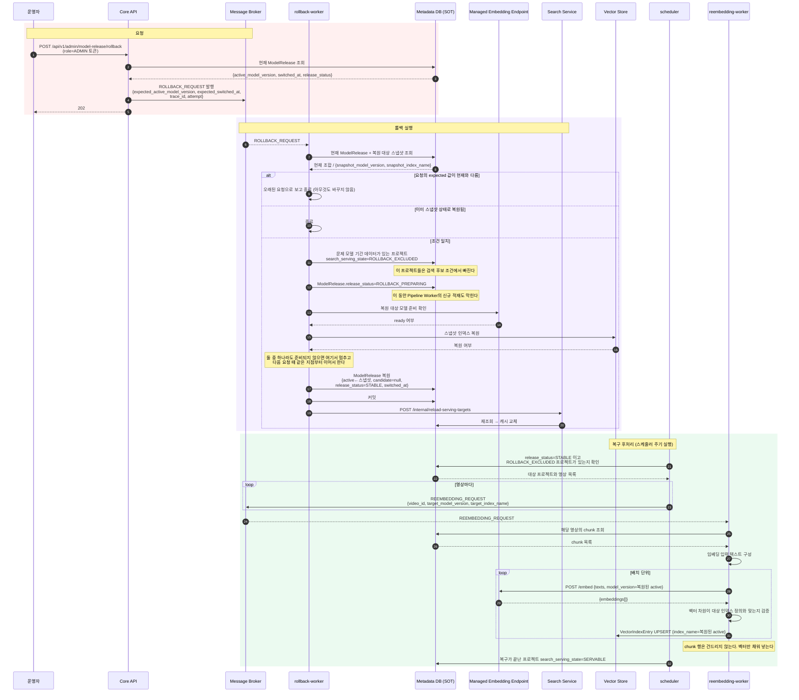
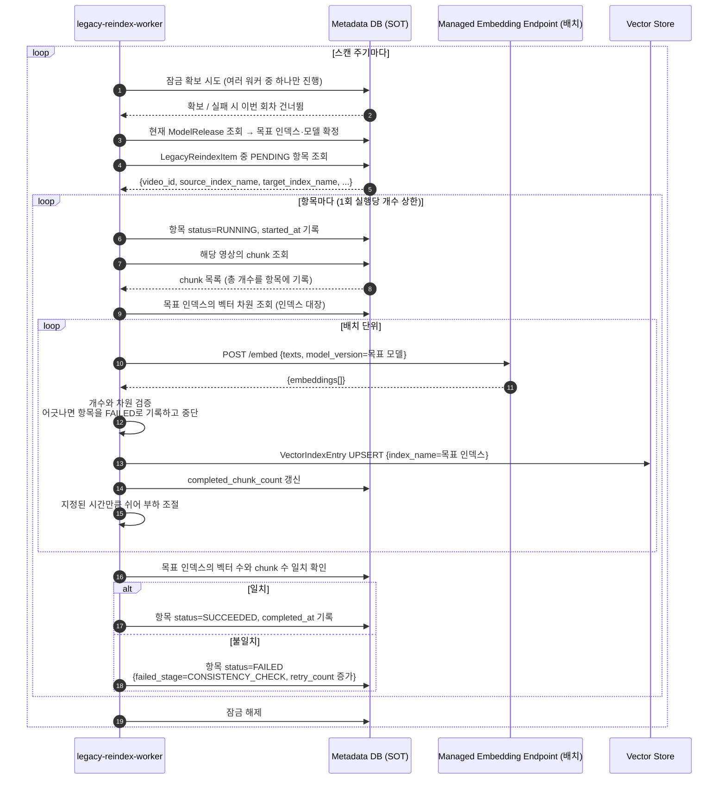

# Biblio Sequence Diagrams

- 기준일: 2026-08-05
- 기준 브랜치: `feat/104-search-load-test-baseline`
- 이 문서는 **현재 코드가 실제로 실행하는 순서**를 그린다. 컴포넌트 구성과 데이터 모델은 `docs/system-design.md`를 따른다.
- 같은 폴더의 `SD-01`~`SD-06` PNG는 이전 설계 시점 그림이며 이 문서가 최신이다.

**읽는 법**

- 화살표 옆에는 그 호출로 오가는 데이터를 적었다. 무엇이 무엇으로 바뀌는지가 드러나게 입력 → 출력 형태로 쓴다.
- `Note`는 저장 위치와 상태 전이를 표시한다.
- 각 다이어그램 아래 표에 "무엇이 어디에 남는가"를 정리했다.

**공통 참여자**

| 표기 | 뜻 |
|---|---|
| `FE` | Frontend. 화면과 백엔드 프록시를 겸한다 |
| `API` | Core API |
| `SS` | Search Service |
| `PW` | Pipeline Worker |
| `EMB` | Managed Embedding Endpoint |
| `DB` | Metadata DB (SOT) |
| `VS` | Vector Store. 물리적으로는 `DB`와 같은 인스턴스의 벡터 테이블 |
| `MQ` | Message Broker. 물리적으로는 `DB` 안의 큐 |
| `OS` | Object Storage |

---

# 1. 영상 등록

로컬 파일과 외부 URL은 큐를 발행하는 시점이 다르다. 로컬 파일은 업로드가 끝난 뒤, 외부 URL은 즉시 발행한다.

**이미 처리 중인 영상에 완료 신호가 다시 오면** 오류 대신 현재 상태를 200으로 돌려준다. 큐 발행이 실패한 업로드를 사용자가 다시 눌러 복구할 수 있게 하기 위해서다.

| 데이터 | 어디에 남는가 |
|---|---|
| 원본 영상 파일 | Object Storage `storage_path` |
| 영상 메타데이터와 `status` | Metadata DB `video` |
| 처리 요청 | Message Broker `PREPROCESS_REQUEST` 큐 |

---

# 2. 영상 처리와 색인

워커 프로세스 하나가 다운로드부터 적재까지 끝까지 들고 간다. 단계 사이마다 처리 시각을 갱신하고 삭제 요청을 다시 확인한다.

| 변환 | 결과가 남는 곳 |
|---|---|
| 영상 → 오디오 | Object Storage + `asset`(AUDIO) |
| 오디오 → 대본 구간 | `transcript_segment` |
| 대본 → 청크 | `chunk.text` |
| 청크 + 키프레임 해석 → 검색용 텍스트 | `chunk.enriched_text` (키워드 검색과 임베딩의 입력) |
| 키프레임 이미지 | Object Storage + `asset`(KEYFRAME) |
| 검색용 텍스트 → 벡터 | `vector_index_entry.embedding_vector` (active 인덱스) |

---

# 3. 처리 실패와 재시도

실패는 단계와 코드로 분류해 남긴다. 재시도는 사용자가 `FAILED` 상태에서만 걸 수 있고, 워커는 남아 있는 산출물을 보고 건너뛴다.

`failed_stage`는 분류값이며 재개 지점과 1:1이 아니다. 청크와 검색용 텍스트는 임베딩 전에 따로 저장하지 않으므로, 임베딩·적재 실패는 청킹부터 다시 한다.

**워커가 죽은 경우** — 처리 시각이 기준 시간보다 오래 멈춘 항목은 다른 워커가 처리권을 다시 가져간다. 이 기준 시간은 큐 가시성 타임아웃보다 짧아야 하며 워커 시작 시 검증한다.

---

# 4. 검색과 답변 생성

| 데이터 | 어디에 남는가 | 쓰임 |
|---|---|---|
| 검색 응답 스냅샷 | `search_response_snapshot` (만료 시각 있음) | 피드백 검증의 기준 |
| 검색 대화 기록 | `search_conversation` (만료 없음) | 검색 기록 화면 |
| 답변 본문 | 저장하지 않음 | 대화 기록의 `answer`로만 남는다 |

**검색 기록 조회**는 `GET /api/v1/search/history?project_id=...`로 `search_conversation`을 그대로 읽는다. 검색을 다시 실행하지 않는다.

---

# 5. 삭제

영상 삭제와 프로젝트 삭제 모두 API가 상태만 바꾸고 큐를 발행한다. 실제 정리는 워커가 한다.

**파이프라인이 진행 중인 경우** — 워커는 각 단계 진입 전에 상태를 다시 읽는다. `DELETING`을 보면 그 자리에서 파이프라인을 멈추고 처리권을 놓은 뒤 삭제를 수행한다.

---

# 6. 피드백 수집

| 데이터 | 어디에 남는가 |
|---|---|
| 정상 피드백 이벤트 | Object Storage `feedback/raw_logs/` (학습 데이터셋의 입력) |
| 형식이 깨진 이벤트 | Object Storage `feedback/error_logs/` (원본 payload 보존) |

---

# 7. 데이터셋 생성 · 재학습 · 서빙 전환

역할이 다른 워커 세 개가 큐로 이어진다. 스케줄러는 시각만 보고 요청을 넣는다.

```mermaid
sequenceDiagram
autonumber
participant SCH as scheduler
participant MQ as Message Broker
participant DSW as dataset-worker
participant TRW as train-release-worker
participant OS as Object Storage
participant DB as Metadata DB (SOT)
participant EMB as Managed Embedding Endpoint (배치·검색 2대)
participant SS as Search Service
participant VS as Vector Store

rect rgb(235, 250, 240)
Note over SCH, OS: 데이터셋 생성
SCH->>MQ: 매일 정해진 시각 → DATASET_GENERATION_REQUEST
MQ-->>DSW: 수신
DSW->>OS: 대상 기간(기본 최근 30일)의 피드백 원본 로그 읽기
OS-->>DSW: 이벤트 목록
DSW->>DSW: event_id 기준 중복 제거 (최신만 남김)
DSW->>DB: 이벤트가 참조한 chunk 본문 조회<br/>+ 같은 프로젝트 안의 랜덤 네거티브 후보 조회
DB-->>DSW: {chunk_id → text}
DSW->>DSW: 질의별 학습 그룹 구성<br/>{query_text, positives[], negatives[],<br/>source_event_ids, 검색 시점 모델·인덱스}
DSW->>OS: 데이터셋 적재<br/>{prefix}/{dataset_version}/train.jsonl<br/>{prefix}/{dataset_version}/manifest.json
end

rect rgb(255, 250, 235)
Note over SCH, DB: 학습과 평가
SCH->>MQ: 매주 정해진 요일·시각 → TRAINING_REQUEST
MQ-->>TRW: 수신
TRW->>OS: 최신 데이터셋 manifest 선택
OS-->>TRW: {dataset_version, rows_uri}
TRW->>DB: 실행 슬롯 확보 → MLPipelineRun 생성 (status=RUNNING)
Note over DB: RUNNING은 동시에 하나, PENDING도 동시에 하나만 허용<br/>더 최신 데이터셋이 오면 기존 PENDING은 SUPERSEDED

TRW->>OS: 현재 서빙 모델 아티팩트 복제 → 후보 버전으로
TRW->>OS: train.jsonl 다운로드
TRW->>TRW: 후보 모델 학습
TRW->>OS: 후보 아티팩트 저장<br/>model_manifest.json · training_metadata.json · scoring_artifact.json
TRW->>DB: MLPipelineRun에 후보 모델 버전 기록

TRW->>OS: 평가용 데이터셋 읽기 (학습셋과 분리된 고정 산출물)
OS-->>TRW: 평가 질의와 정답 기준
TRW->>TRW: 후보 모델 vs 기준 모델 검색 품질 비교
TRW->>DB: ModelEvaluation 저장<br/>{quality_metrics, pass_criteria, overall_decision}
TRW->>OS: 질의별 상세 결과 JSONL 저장

alt overall_decision = FAIL 또는 실행 중 오류
    TRW->>DB: MLPipelineRun {status=FAILED, failed_stage,<br/>failure_type=FAIL 또는 ERROR, failure_reason}
    Note over DB: 기존 서빙은 그대로 유지된다
else overall_decision = PASS
    TRW->>DB: MLPipelineRun status=READY_FOR_RELEASE
end
end

rect rgb(240, 240, 255)
Note over TRW, SS: 후보 배포
TRW->>DB: ModelRelease 상태 확인 (STABLE이어야 함)
TRW->>DB: candidate 열기<br/>{release_status=CANDIDATE_REINDEXING,<br/>candidate_model_version, candidate_index_name, candidate_opened_at}
TRW->>EMB: POST /internal/reload-models (배치 VM · 검색 VM 둘 다)
EMB->>OS: 후보 모델 아티팩트 다운로드
EMB-->>TRW: {ready_model_versions}
Note over TRW: 후보 버전이 목록에 없으면 배포 시도 실패로 기록<br/>시도 횟수가 상한을 넘으면 DEPLOYMENT_BLOCKED

TRW->>DB: 오래된 세대에만 존재하는 영상 수 확인
alt 남아 있음
    TRW->>DB: LegacyReindexItem 등록 (PENDING)
    Note over TRW: 전환을 막고 재색인이 끝난 뒤 다시 시도한다 (9장)
else 없음
    TRW->>DB: ModelRelease 갱신<br/>{active←candidate, previous←직전 active,<br/>candidate=null, release_status=STABLE, switched_at}
    TRW->>DB: 커밋
    TRW->>SS: POST /internal/reload-serving-targets
    SS->>DB: ModelRelease 재조회 → 프로세스 캐시 교체
    TRW->>DB: MLPipelineRun status=DEPLOY_COMPLETED
end
end

Note over VS: 전환 후 previous 인덱스는 남아 있고,<br/>검색은 active와 previous 두 세대까지 함께 조회한다
```

| 산출물 | 어디에 남는가 |
|---|---|
| 학습 데이터셋 | Object Storage `{prefix}/{dataset_version}/train.jsonl` + `manifest.json` |
| 후보 모델 | Object Storage 모델 아티팩트 3종 |
| 평가 집계 | Metadata DB `model_evaluation` |
| 평가 상세 | Object Storage JSONL |
| 실행 이력 | Metadata DB `ml_pipeline_run` |
| 서빙 조합 | Metadata DB `model_release` (한 행) |

**Pipeline Worker에는 전환을 알리지 않는다.** 다음 영상을 처리할 때 릴리스 레코드를 다시 읽는다.

---

# 8. 롤백과 복구

롤백 요청은 Core API가 발행만 하고, 실행은 롤백 워커가 한다. 복구 재임베딩은 롤백 완료와 분리된 후속 작업이다.

**핵심** — 롤백은 벡터를 되살리는 작업이 아니라 **서빙 기준을 되돌리는 작업**이다. 문제 모델이 활성일 때 업로드된 영상은 복원된 인덱스에 아예 없으므로, 그 빈자리는 후속 재임베딩이 채운다. 채워지기 전까지 해당 프로젝트는 검색에서 빠져 있다.

---

# 9. 오래된 세대 재색인

두 세대만 검색에 쓰므로, 그보다 오래된 인덱스에만 있는 영상은 최신 active 인덱스로 옮긴다. 이 작업이 남아 있으면 다음 모델 전환이 막힌다.

**항목은 언제 생기나** — 후보 배포 중 전환 직전 검사에서, 오래된 세대에만 존재하는 영상을 찾아 `LegacyReindexItem`으로 등록한다(7장). 같은 영상·출발 인덱스·도착 인덱스 조합은 하나만 존재한다.

| 상태 | 뜻 |
|---|---|
| `PENDING` | 등록됐고 아직 시작 전 |
| `RUNNING` | 재색인 진행 중 |
| `SUCCEEDED` | 목표 인덱스의 벡터 수가 chunk 수와 일치 |
| `FAILED` | 조회·임베딩·적재·일관성 확인 중 실패. 실패 단계와 횟수를 남긴다 |
| `SKIPPED` | 대상에서 제외된 항목 |
