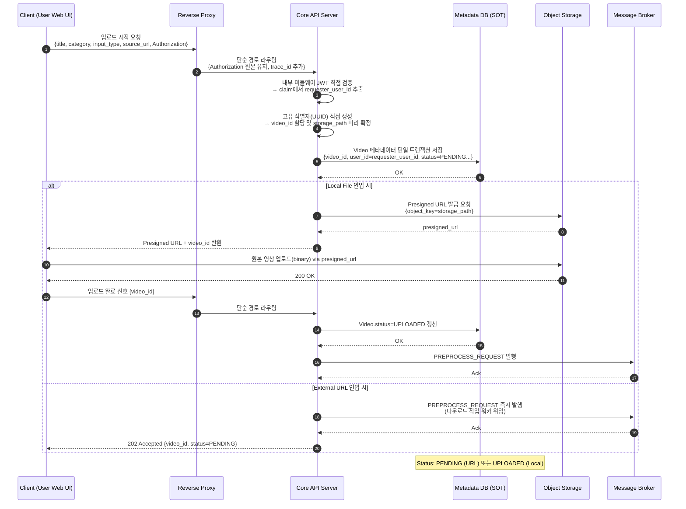
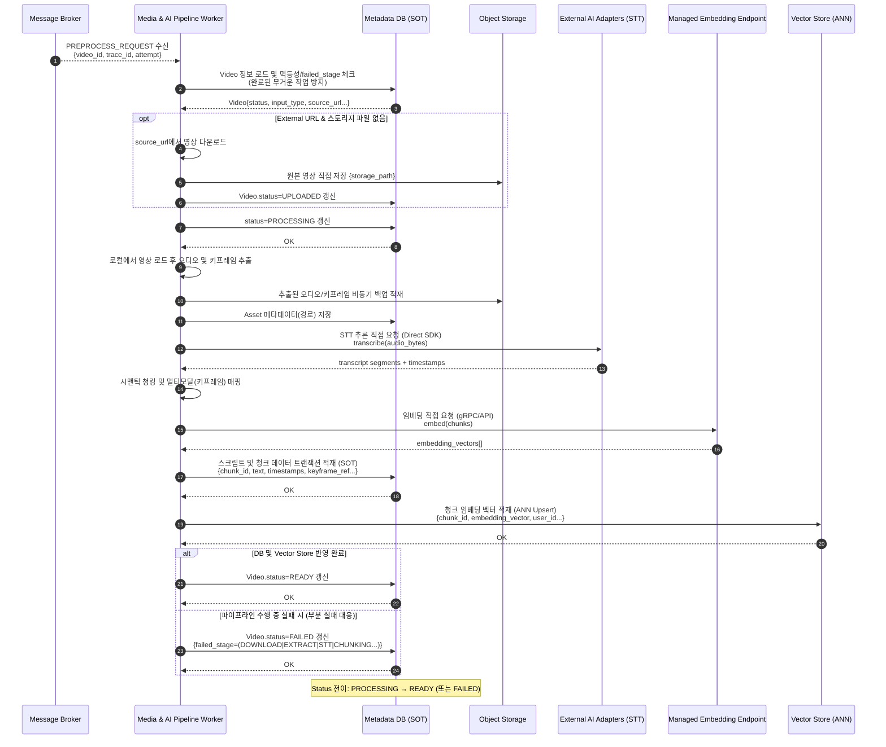
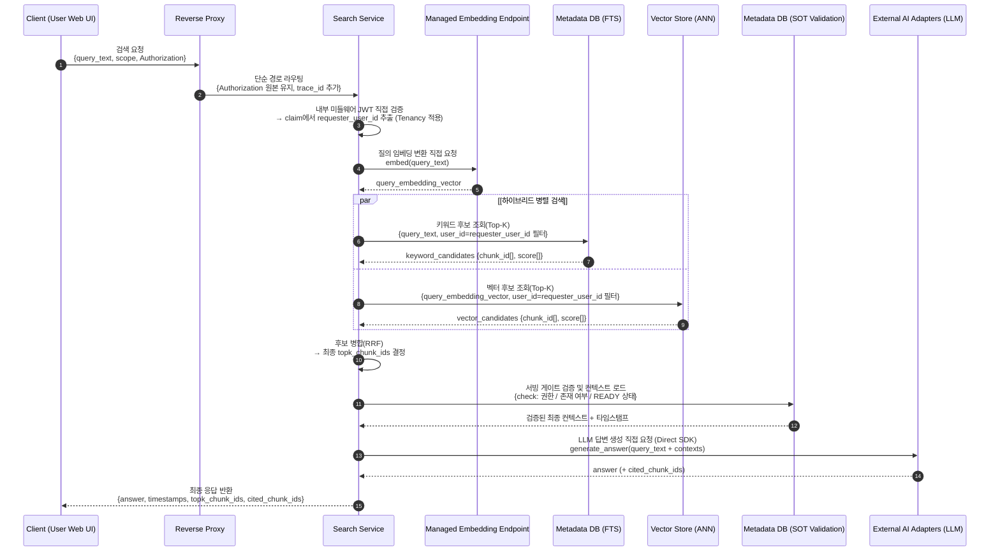

# 1. Video Ingest (Local File & External URL )

```mermaid
sequenceDiagram
autonumber
participant C as Client (User Web UI)
participant RP as Reverse Proxy
participant API as Core API Server
participant DB as Metadata DB (SOT)
participant OS as Object Storage
participant MQ as Message Broker

C->>RP: 업로드 시작 요청<br/>{title, category, input_type, source_url, Authorization}
RP->>API: 단순 경로 라우팅<br/>{Authorization 원본 유지, trace_id 추가}
API->>API: 내부 미들웨어 JWT 직접 검증<br/>→ claim에서 requester_user_id 추출

API->>API: 고유 식별자(UUID) 직접 생성<br/>→ video_id 할당 및 storage_path 미리 확정

API->>DB: Video 메타데이터 단일 트랜잭션 저장<br/>{video_id, user_id=requester_user_id, status=PENDING...}
DB-->>API: OK

alt Local File 인입 시
    API->>OS: Presigned URL 발급 요청<br/>{object_key=storage_path}
    OS-->>API: presigned_url
    API-->>C: Presigned URL + video_id 반환
    
    C->>OS: 원본 영상 업로드(binary) via presigned_url
    OS-->>C: 200 OK
    
    C->>RP: 업로드 완료 신호 {video_id}
    RP->>API: 단순 경로 라우팅
    API->>DB: Video.status=UPLOADED 갱신
    DB-->>API: OK
    
    API->>MQ: PREPROCESS_REQUEST 발행
    MQ-->>API: Ack
else External URL 인입 시
    API->>MQ: PREPROCESS_REQUEST 즉시 발행<br/>(다운로드 작업 워커 위임)
    MQ-->>API: Ack
    API-->>C: 202 Accepted {video_id, status=PENDING}
end

Note over DB: Status: PENDING (URL) 또는 UPLOADED (Local)
```

# 2. Media Processing & AI Indexing

```mermaid
sequenceDiagram
autonumber
participant MQ as Message Broker
participant W as Media & AI Pipeline Worker
participant DB as Metadata DB (SOT)
participant OS as Object Storage
participant STT as External AI Adapters (STT)
participant EMB as Managed Embedding Endpoint
participant VS as Vector Store (ANN)

MQ-->>W: PREPROCESS_REQUEST 수신<br/>{video_id, trace_id, attempt}

W->>DB: Video 정보 로드 및 멱등성/failed_stage 체크<br/>(완료된 무거운 작업 방지)
DB-->>W: Video{status, input_type, source_url...}

opt External URL & 스토리지 파일 없음
    W->>W: source_url에서 영상 다운로드
    W->>OS: 원본 영상 직접 저장 {storage_path}
    W->>DB: Video.status=UPLOADED 갱신
end

W->>DB: status=PROCESSING 갱신
DB-->>W: OK

W->>W: 로컬에서 영상 로드 후 오디오 및 키프레임 추출
W->>OS: 추출된 오디오/키프레임 비동기 백업 적재
W->>DB: Asset 메타데이터(경로) 저장


W->>STT: STT 추론 직접 요청 (Direct SDK)<br/>transcribe(audio_bytes)
STT-->>W: transcript segments + timestamps

W->>W: 시맨틱 청킹 및 멀티모달(키프레임) 매핑

W->>EMB: 임베딩 직접 요청 (gRPC/API)<br/>embed(chunks)
EMB-->>W: embedding_vectors[]

W->>DB: 스크립트 및 청크 데이터 트랜잭션 적재 (SOT)<br/>{chunk_id, text, timestamps, keyframe_ref...}
DB-->>W: OK

W->>VS: 청크 임베딩 벡터 적재 (ANN Upsert)<br/>{chunk_id, embedding_vector, user_id...}
VS-->>W: OK

alt DB 및 Vector Store 반영 완료
  W->>DB: Video.status=READY 갱신
  DB-->>W: OK
else 파이프라인 수행 중 실패 시 (부분 실패 대응)
  W->>DB: Video.status=FAILED 갱신<br/>{failed_stage=(DOWNLOAD|EXTRACT|STT|CHUNKING...)}
  DB-->>W: OK
end

Note over DB: Status 전이: PROCESSING → READY (또는 FAILED)
```

# 3. Search & RAG Serving

```mermaid
sequenceDiagram
autonumber
participant C as Client (User Web UI)
participant RP as Reverse Proxy
participant SS as Search Service
participant EMB as Managed Embedding Endpoint
participant FTS as Metadata DB (FTS)
participant VS as Vector Store (ANN)
participant SOT as Metadata DB (SOT Validation)
participant LLM as External AI Adapters (LLM)

C->>RP: 검색 요청<br/>{query_text, scope, Authorization}
RP->>SS: 단순 경로 라우팅<br/>{Authorization 원본 유지, trace_id 추가}
SS->>SS: 내부 미들웨어 JWT 직접 검증<br/>→ claim에서 requester_user_id 추출 (Tenancy 적용)

SS->>EMB: 질의 임베딩 변환 직접 요청<br/>embed(query_text)
EMB-->>SS: query_embedding_vector

par [하이브리드 병렬 검색]
    SS->>FTS: 키워드 후보 조회(Top-K)<br/>{query_text, user_id=requester_user_id 필터}
    FTS-->>SS: keyword_candidates {chunk_id[], score[]}
and
    SS->>VS: 벡터 후보 조회(Top-K)<br/>{query_embedding_vector, user_id=requester_user_id 필터}
    VS-->>SS: vector_candidates {chunk_id[], score[]}
end

SS->>SS: 후보 병합(RRF)<br/>→ 최종 topk_chunk_ids 결정

SS->>SOT: 서빙 게이트 검증 및 컨텍스트 로드<br/>{check: 권한 / 존재 여부 / READY 상태}
SOT-->>SS: 검증된 최종 컨텍스트 + 타임스탬프

SS->>LLM: LLM 답변 생성 직접 요청 (Direct SDK)<br/>generate_answer(query_text + contexts)
LLM-->>SS: answer (+ cited_chunk_ids)

SS-->>C: 최종 응답 반환<br/>{answer, timestamps, topk_chunk_ids, cited_chunk_ids}
```