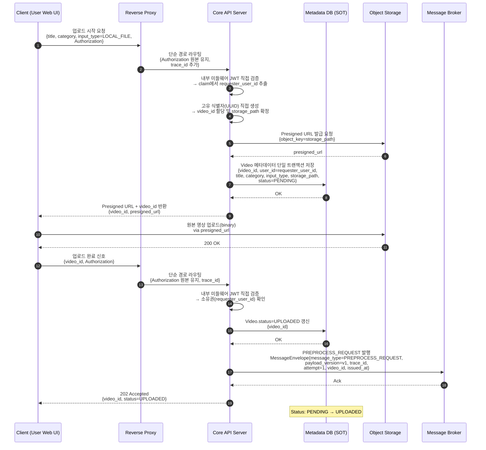
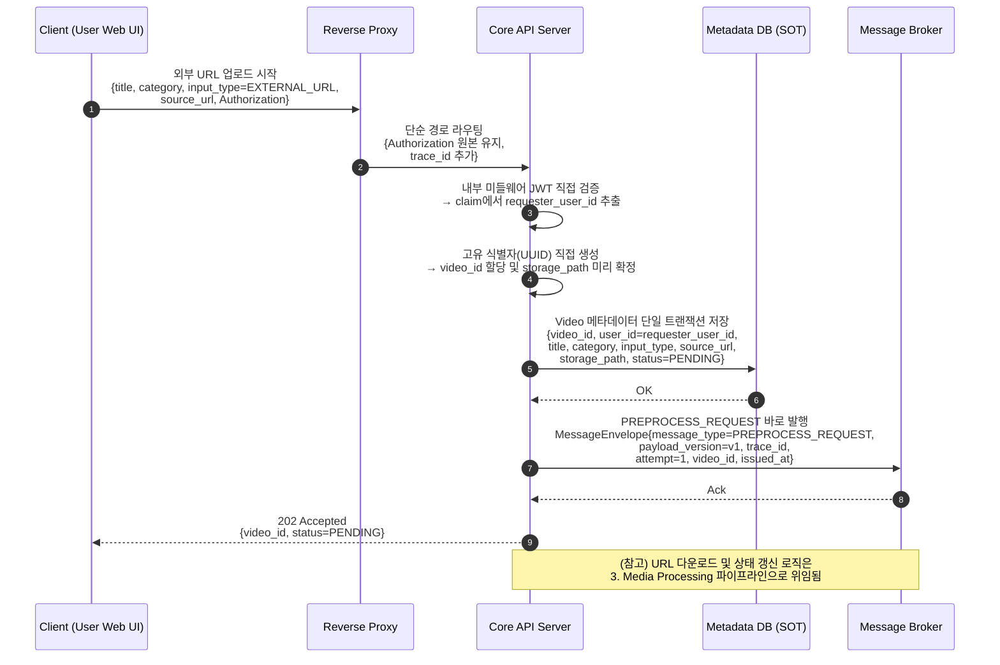
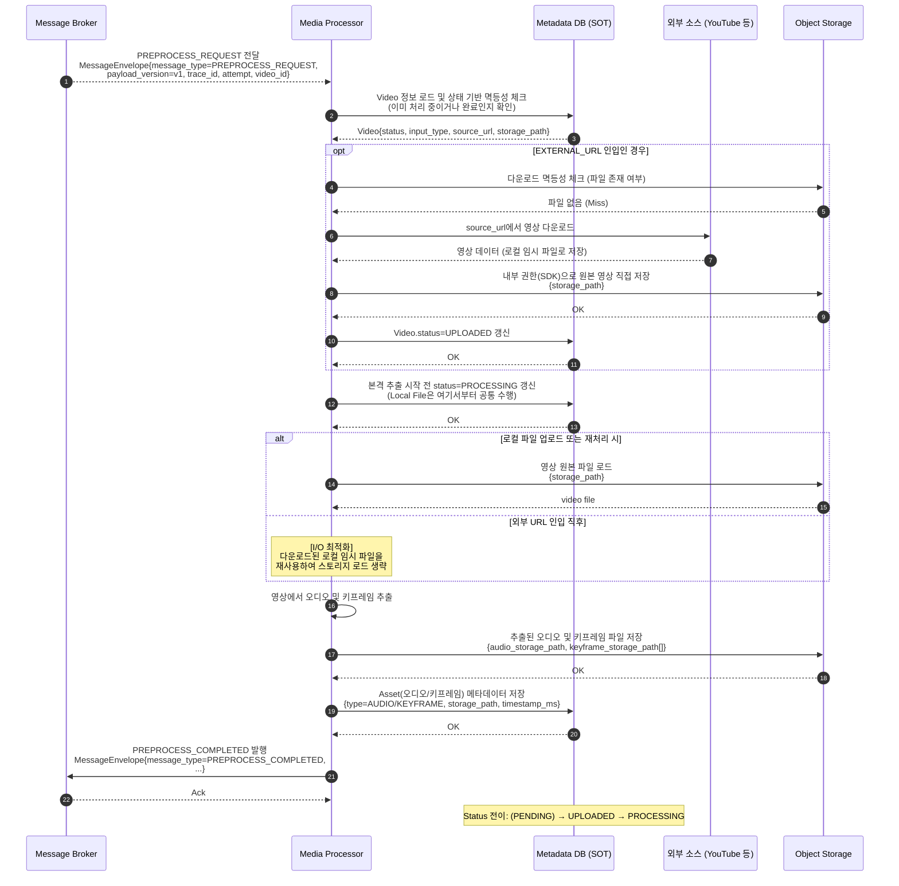
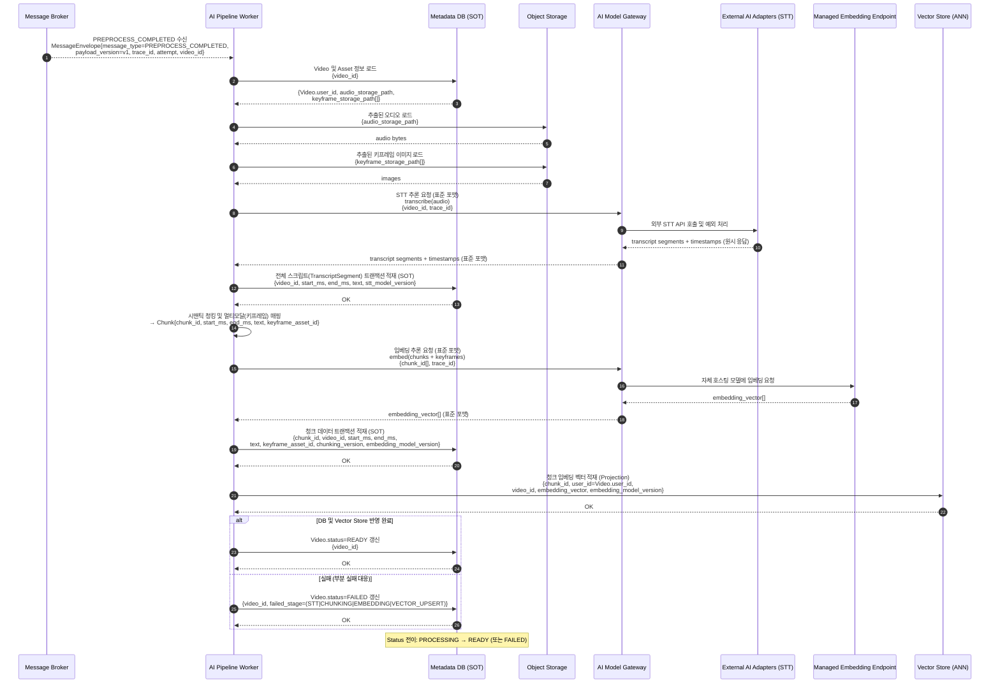
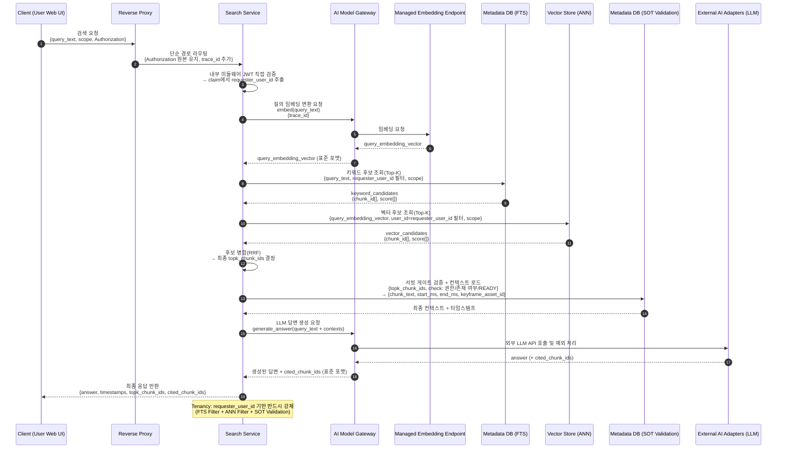

# 1. local video upload

```mermaid
sequenceDiagram
autonumber
participant C as Client (User Web UI)
participant RP as Reverse Proxy
participant API as Core API Server
participant DB as Metadata DB (SOT)
participant OS as Object Storage
participant MQ as Message Broker

C->>RP: 업로드 시작 요청<br/>{title, category, input_type=LOCAL_FILE,<br/>Authorization}
RP->>API: 단순 경로 라우팅<br/>{Authorization 원본 유지,<br/>trace_id 추가}
API->>API: 내부 미들웨어 JWT 직접 검증<br/>→ claim에서 requester_user_id 추출

API->>API: 고유 식별자(UUID) 직접 생성<br/>→ video_id 할당 및 storage_path 확정

API->>OS: Presigned URL 발급 요청<br/>{object_key=storage_path}
OS-->>API: presigned_url

API->>DB: Video 메타데이터 단일 트랜잭션 저장<br/>{video_id, user_id=requester_user_id,<br/>title, category, input_type, storage_path,<br/>status=PENDING}
DB-->>API: OK

API-->>C: Presigned URL + video_id 반환<br/>{video_id, presigned_url}

C->>OS: 원본 영상 업로드(binary)<br/>via presigned_url
OS-->>C: 200 OK

C->>RP: 업로드 완료 신호<br/>{video_id, Authorization}
RP->>API: 단순 경로 라우팅<br/>{Authorization 원본 유지, trace_id}
API->>API: 내부 미들웨어 JWT 직접 검증<br/>→ 소유권(requester_user_id) 확인

API->>DB: Video.status=UPLOADED 갱신<br/>{video_id}
DB-->>API: OK

API->>MQ: PREPROCESS_REQUEST 발행<br/>MessageEnvelope{message_type=PREPROCESS_REQUEST,<br/>payload_version=v1, trace_id,<br/>attempt=1, video_id, issued_at}
MQ-->>API: Ack

API-->>C: 202 Accepted<br/>{video_id, status=UPLOADED}

Note over DB: Status: PENDING → UPLOADED
```

# 2. url video uplaod

```mermaid
sequenceDiagram
autonumber
participant C as Client (User Web UI)
participant RP as Reverse Proxy
participant API as Core API Server
participant DB as Metadata DB (SOT)
participant MQ as Message Broker

C->>RP: 외부 URL 업로드 시작<br/>{title, category, input_type=EXTERNAL_URL,<br/>source_url, Authorization}
RP->>API: 단순 경로 라우팅<br/>{Authorization 원본 유지,<br/>trace_id 추가}
API->>API: 내부 미들웨어 JWT 직접 검증<br/>→ claim에서 requester_user_id 추출

API->>API: 고유 식별자(UUID) 직접 생성<br/>→ video_id 할당 및 storage_path 미리 확정

API->>DB: Video 메타데이터 단일 트랜잭션 저장<br/>{video_id, user_id=requester_user_id,<br/>title, category, input_type, source_url,<br/>storage_path, status=PENDING}
DB-->>API: OK

API->>MQ: PREPROCESS_REQUEST 바로 발행<br/>MessageEnvelope{message_type=PREPROCESS_REQUEST,<br/>payload_version=v1, trace_id,<br/>attempt=1, video_id, issued_at}
MQ-->>API: Ack
API-->>C: 202 Accepted<br/>{video_id, status=PENDING}

Note over API, MQ: (참고) URL 다운로드 및 상태 갱신 로직은<br/>3. Media Processing 파이프라인으로 위임됨
```

# 3. Media Processing

```mermaid
sequenceDiagram
autonumber
participant MQ as Message Broker
participant MP as Media Processor
participant DB as Metadata DB (SOT)
participant EXT as 외부 소스 (YouTube 등)
participant OS as Object Storage

MQ-->>MP: PREPROCESS_REQUEST 전달<br/>MessageEnvelope{message_type=PREPROCESS_REQUEST,<br/>payload_version=v1, trace_id, attempt, video_id}

MP->>DB: Video 정보 로드 및 상태 기반 멱등성 체크<br/>(이미 처리 중이거나 완료인지 확인)
DB-->>MP: Video{status, input_type, source_url, storage_path}

opt EXTERNAL_URL 인입인 경우
    MP->>OS: 다운로드 멱등성 체크 (파일 존재 여부)
    OS-->>MP: 파일 없음 (Miss)
    
    MP->>EXT: source_url에서 영상 다운로드
    EXT-->>MP: 영상 데이터 (로컬 임시 파일로 저장)
    
    MP->>OS: 내부 권한(SDK)으로 원본 영상 직접 저장<br/>{storage_path}
    OS-->>MP: OK
    
    MP->>DB: Video.status=UPLOADED 갱신
    DB-->>MP: OK
end

MP->>DB: 본격 추출 시작 전 status=PROCESSING 갱신<br/>(Local File은 여기서부터 공통 수행)
DB-->>MP: OK

alt 로컬 파일 업로드 또는 재처리 시
    MP->>OS: 영상 원본 파일 로드<br/>{storage_path}
    OS-->>MP: video file
else 외부 URL 인입 직후
    Note over MP: [I/O 최적화]<br/>다운로드된 로컬 임시 파일을<br/>재사용하여 스토리지 로드 생략
end

MP->>MP: 영상에서 오디오 및 키프레임 추출

MP->>OS: 추출된 오디오 및 키프레임 파일 저장<br/>{audio_storage_path, keyframe_storage_path[]}
OS-->>MP: OK

MP->>DB: Asset(오디오/키프레임) 메타데이터 저장<br/>{type=AUDIO/KEYFRAME, storage_path, timestamp_ms}
DB-->>MP: OK

MP->>MQ: PREPROCESS_COMPLETED 발행<br/>MessageEnvelope{message_type=PREPROCESS_COMPLETED,<br/>...}
MQ-->>MP: Ack

Note over DB: Status 전이: (PENDING) → UPLOADED → PROCESSING

```

# 4. AI Analysis & Indexing(STT→청킹→임베딩→적재→READY)

```mermaid
sequenceDiagram
autonumber
participant MQ as Message Broker
participant W as AI Pipeline Worker
participant DB as Metadata DB (SOT)
participant OS as Object Storage
participant GW as AI Model Gateway
participant STT as External AI Adapters (STT)
participant EMB as Managed Embedding Endpoint
participant VS as Vector Store (ANN)

MQ-->>W: PREPROCESS_COMPLETED 수신<br/>MessageEnvelope{message_type=PREPROCESS_COMPLETED,<br/>payload_version=v1, trace_id, attempt, video_id}

W->>DB: Video 및 Asset 정보 로드<br/>{video_id}
DB-->>W: {Video.user_id, audio_storage_path,<br/>keyframe_storage_path[]}

W->>OS: 추출된 오디오 로드<br/>{audio_storage_path}
OS-->>W: audio bytes
W->>OS: 추출된 키프레임 이미지 로드<br/>{keyframe_storage_path[]}
OS-->>W: images

W->>GW: STT 추론 요청 (표준 포맷)<br/>transcribe(audio)<br/>{video_id, trace_id}
GW->>STT: 외부 STT API 호출 및 예외 처리
STT-->>GW: transcript segments + timestamps (원시 응답)
GW-->>W: transcript segments + timestamps (표준 포맷)

W->>DB: 전체 스크립트(TranscriptSegment) 트랜잭션 적재 (SOT)<br/>{video_id, start_ms, end_ms, text, stt_model_version}
DB-->>W: OK

W->>W: 시맨틱 청킹 및 멀티모달(키프레임) 매핑<br/>→ Chunk{chunk_id, start_ms, end_ms, text, keyframe_asset_id}

W->>GW: 임베딩 추론 요청 (표준 포맷)<br/>embed(chunks + keyframes)<br/>{chunk_id[], trace_id}
GW->>EMB: 자체 호스팅 모델에 임베딩 요청
EMB-->>GW: embedding_vector[]
GW-->>W: embedding_vector[] (표준 포맷)

W->>DB: 청크 데이터 트랜잭션 적재 (SOT)<br/>{chunk_id, video_id, start_ms, end_ms,<br/>text, keyframe_asset_id, chunking_version, embedding_model_version}
DB-->>W: OK

W->>VS: 청크 임베딩 벡터 적재 (Projection)<br/>{chunk_id, user_id=Video.user_id,<br/>video_id, embedding_vector, embedding_model_version}
VS-->>W: OK

alt DB 및 Vector Store 반영 완료
  W->>DB: Video.status=READY 갱신<br/>{video_id}
  DB-->>W: OK
else 실패 (부분 실패 대응)
  W->>DB: Video.status=FAILED 갱신<br/>{video_id, failed_stage=(STT|CHUNKING|EMBEDDING|VECTOR_UPSERT)}
  DB-->>W: OK
end

Note over DB: Status 전이: PROCESSING → READY (또는 FAILED)
```

# 5. Search & RAG Serving

```mermaid
sequenceDiagram
autonumber
participant C as Client (User Web UI)
participant RP as Reverse Proxy
participant SS as Search Service
participant GW as AI Model Gateway
participant EMB as Managed Embedding Endpoint
participant FTS as Metadata DB (FTS)
participant VS as Vector Store (ANN)
participant SOT as Metadata DB (SOT Validation)
participant LLM as External AI Adapters (LLM)

C->>RP: 검색 요청<br/>{query_text, scope, Authorization}
RP->>SS: 단순 경로 라우팅<br/>{Authorization 원본 유지, trace_id 추가}
SS->>SS: 내부 미들웨어 JWT 직접 검증<br/>→ claim에서 requester_user_id 추출

SS->>GW: 질의 임베딩 변환 요청<br/>embed(query_text)<br/>{trace_id}
GW->>EMB: 임베딩 요청
EMB-->>GW: query_embedding_vector
GW-->>SS: query_embedding_vector (표준 포맷)

SS->>FTS: 키워드 후보 조회(Top-K)<br/>{query_text, requester_user_id 필터, scope}
FTS-->>SS: keyword_candidates<br/>{chunk_id[], score[]}

SS->>VS: 벡터 후보 조회(Top-K)<br/>{query_embedding_vector, user_id=requester_user_id 필터, scope}
VS-->>SS: vector_candidates<br/>{chunk_id[], score[]}

SS->>SS: 후보 병합(RRF)<br/>→ 최종 topk_chunk_ids 결정

SS->>SOT: 서빙 게이트 검증 + 컨텍스트 로드<br/>{topk_chunk_ids, check: 권한/존재 여부/READY}<br/>→ {chunk_text, start_ms, end_ms, keyframe_asset_id}
SOT-->>SS: 최종 컨텍스트 + 타임스탬프

SS->>GW: LLM 답변 생성 요청<br/>generate_answer(query_text + contexts)
GW->>LLM: 외부 LLM API 호출 및 예외 처리
LLM-->>GW: answer (+ cited_chunk_ids)
GW-->>SS: 생성된 답변 + cited_chunk_ids (표준 포맷)

SS-->>C: 최종 응답 반환<br/>{answer, timestamps, topk_chunk_ids, cited_chunk_ids}

Note over SS: Tenancy: requester_user_id 기반 반드시 강제<br/>(FTS Filter + ANN Filter + SOT Validation)
```